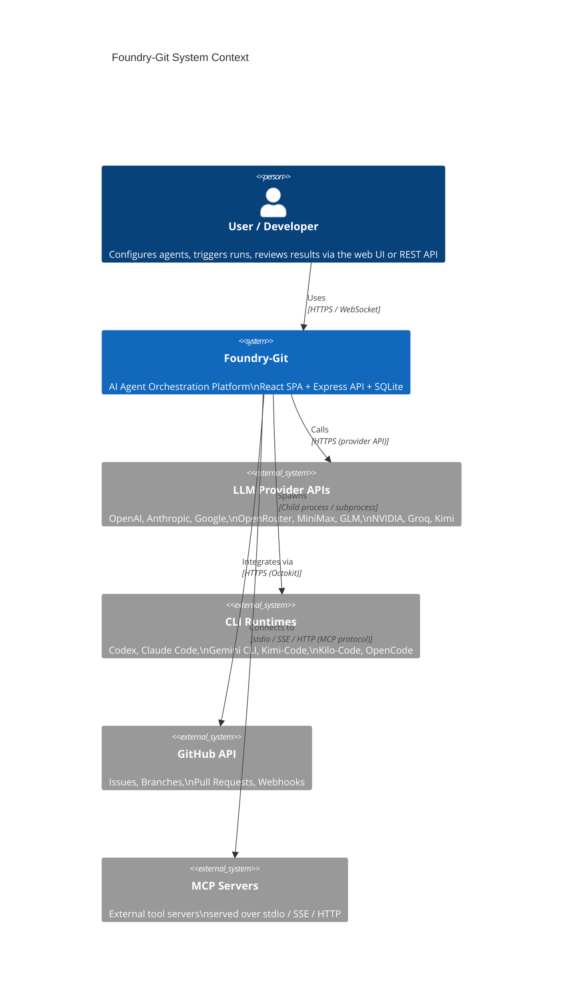
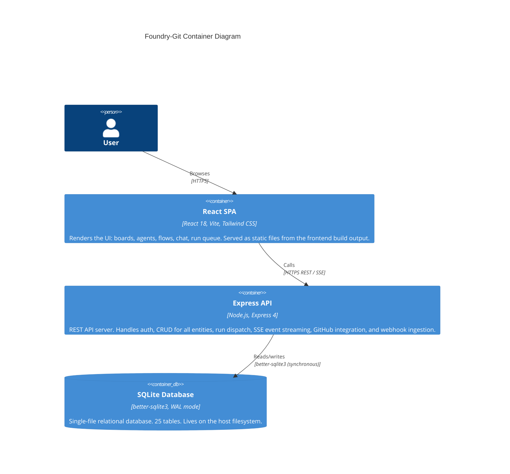
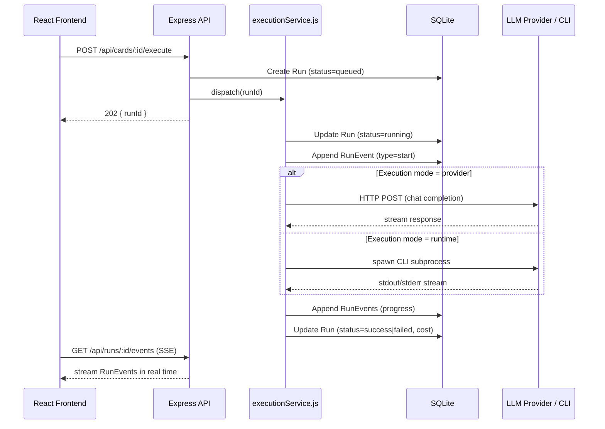

# Architecture Overview

Foundry-Git is an **AI Agent Orchestration Platform** — a web application that lets teams configure, execute, and monitor AI agents across a variety of LLM providers and CLI runtimes. It is structured as a monorepo containing a Node.js/Express backend and a React frontend, backed by SQLite.

---

## System Context

The following diagram places Foundry-Git in its broader environment:



---

## Container Diagram

Within the Foundry-Git system, there are two primary deployment units:



---

## Monorepo Layout

```
Foundry-Git/
├── package.json          ← npm workspaces root
├── backend/              ← Node.js/Express API
│   └── src/
│       ├── index.js
│       ├── db/           ← SQLite schema + migrations
│       ├── routes/       ← 18+ Express route modules
│       ├── services/     ← executionService, flowService, githubService
│       └── middleware/   ← auth.js (JWT + RBAC)
├── frontend/             ← React 18 SPA
│   └── src/
│       ├── App.jsx
│       ├── pages/        ← 18 page components
│       └── components/   ← Shell, Modal, StatusBadge, api.js, …
└── docs/                 ← This documentation suite (41 files)
```

*For the full annotated file tree, see [Repository Map](30-repo-map.md).*

---

## Technology Stack

### Backend

| Technology | Role |
|---|---|
| **Node.js** (LTS) | JavaScript runtime |
| **Express 4** | HTTP framework; request routing, middleware pipeline |
| **better-sqlite3** | Synchronous SQLite driver; WAL mode; prepared statements |
| **jsonwebtoken (JWT)** | Token signing and verification for auth |
| **@octokit/rest** | GitHub API client (REST) |
| **uuid** | UUID generation for entity IDs |
| **zod** | Runtime schema validation for request bodies |
| **dotenv** | Environment variable loading from `.env` |
| **cors** | CORS header middleware |

### Frontend

| Technology | Role |
|---|---|
| **React 18** | UI component framework; concurrent rendering |
| **React Router v6** | Client-side routing |
| **Vite** | Dev server (with `/api` proxy) + production bundler |
| **Tailwind CSS** | Utility-first CSS framework |
| **PostCSS / Autoprefixer** | CSS processing pipeline |

### Infrastructure

| Technology | Role |
|---|---|
| **SQLite** | Embedded relational database (single `.db` file) |
| **GitHub Actions** (optional) | CI/CD pipeline |
| **Docker** (optional) | Container packaging for deployment |

---

## Key Design Principles

### 1. Workspace-Scoped Tenancy
Every resource (project, agent, team, flow, provider, runtime, skill, MCP server, webhook) belongs to a **workspace**. This provides clean isolation between teams or organisations sharing a single Foundry-Git installation. See [Workspace & Project Guide](07-workspace-and-project-guide.md) and [ADR-008](29-decision-log.md#adr-008).

### 2. Dual Execution Modes
Agents can execute via either:
- **Provider mode** — a direct HTTP call to an LLM API (OpenAI, Anthropic, etc.)
- **Runtime mode** — a spawned CLI subprocess (Codex, Claude Code, etc.)

A single `execution_mode` column on the agent record selects the path. A `fallback_provider_config_id` enables automatic failover. See [Provider & Runtime Matrix](05-provider-runtime-matrix.md) and [ADR-005](29-decision-log.md#adr-005).

### 3. Event-Driven Run Lifecycle
Every **Run** transitions through a defined set of states (`queued → running → success | failed | cancelled`). Each state transition and significant event appends an immutable **Run Event** record. The frontend subscribes to events via **Server-Sent Events (SSE)**, giving live visibility into execution progress. See [Event & Run Lifecycle](06-event-and-run-lifecycle.md).

### 4. Position-Based Sequential Flows
**Flows** are ordered sequences of **Flow Steps** sorted by a `position` integer. This model prioritises simplicity and ease of use over the full expressiveness of a DAG. Three step types — `agent`, `condition`, `parallel` — cover the majority of automation patterns. See [Flow Builder](11-flow-builder.md) and [ADR-006](29-decision-log.md#adr-006).

### 5. Agent Memory Persistence
Agents accumulate facts via an **Agent Memory** key-value store with importance levels (1–5). Memories persist across runs and chat sessions, enabling agents to build context over time without requiring a vector database. See [Agent Configuration](09-agent-configuration.md) and [ADR-009](29-decision-log.md#adr-009).

### 6. Secret Masking
API keys stored in **Provider Configs** are never returned in API responses. Responses substitute `api_key_set: boolean` to confirm presence without exposing the secret. See [ADR-004](29-decision-log.md#adr-004).

### 7. Auth-Optional by Default
Authentication is toggled by the presence of `FOUNDRY_ADMIN_PASSWORD`. When absent, the platform runs open — ideal for local development. When set, all routes require a valid JWT Bearer token. See [Authentication & RBAC](04-auth-and-rbac.md) and [ADR-003](29-decision-log.md#adr-003).

---

## Data Flow: Card Execution

The following sequence illustrates what happens when a user triggers a card execution:



---

## Cross-References

| Topic | Document |
|---|---|
| Full database schema | [Data Model](02-data-model.md) |
| All REST endpoints | [API Reference](03-api-reference.md) |
| Authentication details | [Authentication & RBAC](04-auth-and-rbac.md) |
| Provider and runtime support | [Provider & Runtime Matrix](05-provider-runtime-matrix.md) |
| Run state machine | [Event & Run Lifecycle](06-event-and-run-lifecycle.md) |
| Deployment instructions | [Deployment Guide](15-deployment-guide.md) |
| Local development setup | [Local Dev Setup](20-local-dev-setup.md) |
| Backend internals | [Backend Architecture](21-backend-architecture.md) |
| Frontend internals | [Frontend Architecture](22-frontend-architecture.md) |
