# Data Model

Complete reference for the Foundry-Git relational schema. The database is SQLite using `better-sqlite3` with WAL mode and foreign key enforcement enabled. All entity IDs are UUIDs generated by the application layer.

---

## Entity-Relationship Diagram

```mermaid
erDiagram
    workspaces {
        text id PK
        text name
        text slug UK
        text created_at
        text updated_at
    }

    projects {
        text id PK
        text workspace_id FK
        text name
        text slug
        text description
        text repo_url
        text repo_owner
        text repo_name
        text default_branch
    }

    boards {
        text id PK
        text project_id FK
        text name
    }

    board_columns {
        text id PK
        text board_id FK
        text name
        integer position
    }

    cards {
        text id PK
        text board_id FK
        text column_id FK
        text project_id FK
        text title
        text description
        text status
        text priority
        text assignee_agent_id FK
        text run_id
        integer github_issue_number
        text github_issue_url
    }

    agents {
        text id PK
        text workspace_id FK
        text name
        text description
        text provider_config_id FK
        text runtime_config_id FK
        text execution_mode
        text fallback_provider_config_id FK
        text system_prompt
        real monthly_budget_usd
    }

    provider_configs {
        text id PK
        text workspace_id FK
        text name
        text provider_type
        text base_url
        text api_key_env_var
        text api_key
        text model
        integer is_default
    }

    runtime_configs {
        text id PK
        text workspace_id FK
        text name
        text runtime_type
        text binary_path
        text extra_args
        integer is_default
    }

    teams {
        text id PK
        text workspace_id FK
        text name
        text description
        text parent_team_id FK
        text manager_agent_id FK
    }

    team_memberships {
        text id PK
        text team_id FK
        text agent_id FK
        text role
        text title
    }

    project_teams {
        text id PK
        text project_id FK
        text team_id FK
    }

    execution_policies {
        text id PK
        text workspace_id FK
        text name
        integer max_retries
        integer timeout_seconds
        integer fallback_enabled
    }

    runs {
        text id PK
        text project_id FK
        text card_id FK
        text agent_id FK
        text status
        text started_at
        text finished_at
        integer exit_code
        text error_message
        text runtime_type
        text provider_type
        text branch_name
        text worktree_path
        integer pr_number
        text pr_url
        integer tokens_input
        integer tokens_output
        real cost_usd
    }

    run_events {
        text id PK
        text run_id FK
        text event_type
        text message
        text metadata_json
        text created_at
    }

    github_connections {
        text id PK
        text workspace_id FK
        text name
        text access_token_env_var
        text installation_id
        text app_id
        integer is_default
    }

    flows {
        text id PK
        text workspace_id FK
        text project_id FK
        text name
        text description
        text status
    }

    flow_steps {
        text id PK
        text flow_id FK
        text agent_id FK
        text name
        text step_type
        integer position
        text config_json
    }

    flow_runs {
        text id PK
        text flow_id FK
        text project_id FK
        text card_id FK
        text status
        text current_step_id FK
        text started_at
        text finished_at
        text error_message
    }

    chat_messages {
        text id PK
        text workspace_id FK
        text agent_id FK
        text role
        text content
        text session_id
        integer tokens_input
        integer tokens_output
        real cost_usd
        text metadata_json
    }

    skills {
        text id PK
        text workspace_id FK
        text name
        text description
        text skill_type
        text content
        integer is_public
    }

    agent_skills {
        text id PK
        text agent_id FK
        text skill_id FK
    }

    mcp_servers {
        text id PK
        text workspace_id FK
        text name
        text description
        text command
        text args_json
        text env_json
        text transport
        integer is_enabled
    }

    users {
        text id PK
        text workspace_id FK
        text username UK
        text email
        text password_hash
        text role
        integer is_active
    }

    webhook_configs {
        text id PK
        text workspace_id FK
        text name
        text flow_id FK
        text secret
        text events_json
        text project_id FK
        integer is_enabled
    }

    companies {
        text id PK
        text workspace_id FK
        text name
        text description
        text website
        text industry
        text company_size
        text contact_name
        text contact_email
        text notes
    }

    company_projects {
        text id PK
        text company_id FK
        text project_id FK
    }

    agent_memories {
        text id PK
        text agent_id FK
        text workspace_id FK
        text memory_key
        text content
        text session_id
        integer importance
    }

    workspaces ||--o{ projects : "has"
    workspaces ||--o{ provider_configs : "has"
    workspaces ||--o{ runtime_configs : "has"
    workspaces ||--o{ agents : "has"
    workspaces ||--o{ teams : "has"
    workspaces ||--o{ execution_policies : "has"
    workspaces ||--o{ github_connections : "has"
    workspaces ||--o{ flows : "has"
    workspaces ||--o{ chat_messages : "has"
    workspaces ||--o{ skills : "has"
    workspaces ||--o{ mcp_servers : "has"
    workspaces ||--o{ users : "has"
    workspaces ||--o{ webhook_configs : "has"
    workspaces ||--o{ companies : "has"
    workspaces ||--o{ agent_memories : "has"

    projects ||--o{ boards : "has"
    projects ||--o{ cards : "has"
    projects ||--o{ runs : "has"
    projects ||--o{ flow_runs : "has"
    projects ||--o{ project_teams : "has"
    projects ||--o{ company_projects : "has"

    boards ||--o{ board_columns : "has"
    boards ||--o{ cards : "placed on"

    board_columns ||--o{ cards : "contains"

    agents ||--o{ cards : "assigned to"
    agents ||--o{ runs : "executes"
    agents ||--o{ team_memberships : "member of"
    agents ||--o{ flow_steps : "used in"
    agents ||--o{ chat_messages : "participates in"
    agents ||--o{ agent_skills : "has"
    agents ||--o{ agent_memories : "has"
    agents }o--|| provider_configs : "uses"
    agents }o--|| runtime_configs : "uses"

    teams ||--o{ team_memberships : "has"
    teams ||--o{ project_teams : "assigned to"
    teams }o--o| teams : "parent of"

    flows ||--o{ flow_steps : "has"
    flows ||--o{ flow_runs : "has"
    flows ||--o{ webhook_configs : "triggered by"

    flow_runs }o--o| flow_steps : "current step"

    runs ||--o{ run_events : "emits"

    skills ||--o{ agent_skills : "used by"

    companies ||--o{ company_projects : "has"
```

---

## Table Reference

### `workspaces`

The root multi-tenancy entity. All other resources are scoped to a workspace.

| Column | Type | Constraints | Default | Description |
|---|---|---|---|---|
| `id` | TEXT | PRIMARY KEY | — | UUID |
| `name` | TEXT | NOT NULL | — | Display name |
| `slug` | TEXT | UNIQUE NOT NULL | — | URL-safe identifier |
| `created_at` | TEXT | | `CURRENT_TIMESTAMP` | ISO-8601 creation time |
| `updated_at` | TEXT | | `CURRENT_TIMESTAMP` | ISO-8601 last update time |

**Business rules**: `slug` must be unique globally. Used as the URL segment for workspace navigation.

---

### `projects`

A container for boards, cards, flows, and runs within a workspace.

| Column | Type | Constraints | Default | Description |
|---|---|---|---|---|
| `id` | TEXT | PRIMARY KEY | — | UUID |
| `workspace_id` | TEXT | FK→workspaces ON DELETE CASCADE | — | Owning workspace |
| `name` | TEXT | NOT NULL | — | Display name |
| `slug` | TEXT | NOT NULL | — | URL-safe identifier within workspace |
| `description` | TEXT | | NULL | Free-text description |
| `repo_url` | TEXT | | NULL | Full GitHub repository URL |
| `repo_owner` | TEXT | | NULL | GitHub org or user name |
| `repo_name` | TEXT | | NULL | GitHub repository name |
| `default_branch` | TEXT | | `'main'` | Default Git branch for operations |

**Constraints**: `UNIQUE(workspace_id, slug)` — slugs are unique within a workspace, not globally.

---

### `boards`

A Kanban board scoped to a project.

| Column | Type | Constraints | Default | Description |
|---|---|---|---|---|
| `id` | TEXT | PRIMARY KEY | — | UUID |
| `project_id` | TEXT | FK→projects ON DELETE CASCADE | — | Owning project |
| `name` | TEXT | NOT NULL | — | Board display name |

---

### `board_columns`

An ordered lane within a board.

| Column | Type | Constraints | Default | Description |
|---|---|---|---|---|
| `id` | TEXT | PRIMARY KEY | — | UUID |
| `board_id` | TEXT | FK→boards ON DELETE CASCADE | — | Owning board |
| `name` | TEXT | NOT NULL | — | Column label (e.g., "In Progress") |
| `position` | INTEGER | | `0` | Sort order (ascending) |

---

### `cards`

The atomic unit of work on a board.

| Column | Type | Constraints | Default | Description |
|---|---|---|---|---|
| `id` | TEXT | PRIMARY KEY | — | UUID |
| `board_id` | TEXT | FK→boards ON DELETE SET NULL | NULL | Board placement (nullable) |
| `column_id` | TEXT | FK→board_columns ON DELETE SET NULL | NULL | Column placement (nullable) |
| `project_id` | TEXT | FK→projects ON DELETE CASCADE | — | Owning project |
| `title` | TEXT | NOT NULL | — | Card title |
| `description` | TEXT | | NULL | Detailed description / task spec |
| `status` | TEXT | | `'todo'` | Workflow status string |
| `priority` | TEXT | | `'medium'` | `'low'`/`'medium'`/`'high'`/`'critical'` |
| `assignee_agent_id` | TEXT | FK→agents ON DELETE SET NULL | NULL | Assigned AI agent |
| `run_id` | TEXT | | NULL | Last associated run ID |
| `github_issue_number` | INTEGER | | NULL | Linked GitHub issue number |
| `github_issue_url` | TEXT | | NULL | Full URL to linked GitHub issue |

**Business rules**: A card survives board/column deletion (SET NULL). Deletion of the parent project cascades to delete cards.

---

### `provider_configs`

Stored configuration for an LLM provider API connection.

| Column | Type | Constraints | Default | Description |
|---|---|---|---|---|
| `id` | TEXT | PRIMARY KEY | — | UUID |
| `workspace_id` | TEXT | FK→workspaces | — | Owning workspace |
| `name` | TEXT | NOT NULL | — | Human-readable config name |
| `provider_type` | TEXT | CHECK(...) | — | See supported values below |
| `base_url` | TEXT | | NULL | Optional API base URL override |
| `api_key_env_var` | TEXT | | NULL | Env var name holding the API key |
| `api_key` | TEXT | | NULL | API key stored directly (encrypted at rest recommended) |
| `model` | TEXT | | NULL | Model identifier (e.g., `gpt-4o`) |
| `is_default` | INTEGER | | `0` | `1` = default config for this workspace |

**Supported `provider_type` values**: `openai`, `anthropic`, `google`, `openrouter`, `minimax`, `glm`, `nvidia`, `groq`, `kimi`

**Security**: The `api_key` column value is **never returned** in API responses. Responses include `api_key_set: boolean` instead.

---

### `runtime_configs`

Stored configuration for a CLI-based execution runtime.

| Column | Type | Constraints | Default | Description |
|---|---|---|---|---|
| `id` | TEXT | PRIMARY KEY | — | UUID |
| `workspace_id` | TEXT | FK→workspaces | — | Owning workspace |
| `name` | TEXT | NOT NULL | — | Human-readable config name |
| `runtime_type` | TEXT | CHECK(...) | — | See supported values below |
| `binary_path` | TEXT | | NULL | Absolute path to the CLI binary |
| `extra_args` | TEXT | | NULL | Additional CLI arguments (space-separated) |
| `is_default` | INTEGER | | `0` | `1` = default config for this workspace |

**Supported `runtime_type` values**: `codex`, `claude-code`, `gemini-cli`, `kimi-code`, `kilo-code`, `opencode`

---

### `agents`

An AI entity that can execute tasks via a provider API or a CLI runtime.

| Column | Type | Constraints | Default | Description |
|---|---|---|---|---|
| `id` | TEXT | PRIMARY KEY | — | UUID |
| `workspace_id` | TEXT | FK→workspaces | — | Owning workspace |
| `name` | TEXT | NOT NULL | — | Agent display name |
| `description` | TEXT | | NULL | Purpose description |
| `provider_config_id` | TEXT | FK→provider_configs ON DELETE SET NULL | NULL | Primary provider (for `provider` mode) |
| `runtime_config_id` | TEXT | FK→runtime_configs ON DELETE SET NULL | NULL | Runtime (for `runtime` mode) |
| `execution_mode` | TEXT | CHECK('provider','runtime') | — | Which execution path to use |
| `fallback_provider_config_id` | TEXT | FK→provider_configs ON DELETE SET NULL | NULL | Fallback if primary execution fails |
| `system_prompt` | TEXT | | NULL | Base system prompt injected on every call |
| `monthly_budget_usd` | REAL | | NULL | Optional cost cap per calendar month |

---

### `teams`

A named group of agents supporting hierarchical nesting.

| Column | Type | Constraints | Default | Description |
|---|---|---|---|---|
| `id` | TEXT | PRIMARY KEY | — | UUID |
| `workspace_id` | TEXT | FK→workspaces | — | Owning workspace |
| `name` | TEXT | NOT NULL | — | Team name |
| `description` | TEXT | | NULL | Team purpose |
| `parent_team_id` | TEXT | FK→teams ON DELETE SET NULL | NULL | Parent team (self-referential) |
| `manager_agent_id` | TEXT | FK→agents ON DELETE SET NULL | NULL | Managing agent |

---

### `team_memberships`

Join table between agents and teams.

| Column | Type | Constraints | Default | Description |
|---|---|---|---|---|
| `id` | TEXT | PRIMARY KEY | — | UUID |
| `team_id` | TEXT | FK→teams ON DELETE CASCADE | — | Team |
| `agent_id` | TEXT | FK→agents ON DELETE CASCADE | — | Agent member |
| `role` | TEXT | | `'member'` | Role within team |
| `title` | TEXT | | NULL | Optional title (e.g., "Lead Engineer") |

**Constraints**: `UNIQUE(team_id, agent_id)` — an agent can only be in a team once.

---

### `project_teams`

Join table between projects and teams.

| Column | Type | Constraints | Default | Description |
|---|---|---|---|---|
| `id` | TEXT | PRIMARY KEY | — | UUID |
| `project_id` | TEXT | FK→projects ON DELETE CASCADE | — | Project |
| `team_id` | TEXT | FK→teams ON DELETE CASCADE | — | Team |

**Constraints**: `UNIQUE(project_id, team_id)`

---

### `execution_policies`

Reusable retry and timeout rules for run execution.

| Column | Type | Constraints | Default | Description |
|---|---|---|---|---|
| `id` | TEXT | PRIMARY KEY | — | UUID |
| `workspace_id` | TEXT | FK→workspaces | — | Owning workspace |
| `name` | TEXT | NOT NULL | — | Policy name |
| `max_retries` | INTEGER | | `3` | Maximum retry attempts on failure |
| `timeout_seconds` | INTEGER | | `300` | Execution timeout (5 minutes default) |
| `fallback_enabled` | INTEGER | | `0` | `1` = enable fallback to `fallback_provider_config_id` |

---

### `runs`

A single execution attempt of an agent on a task.

| Column | Type | Constraints | Default | Description |
|---|---|---|---|---|
| `id` | TEXT | PRIMARY KEY | — | UUID |
| `project_id` | TEXT | FK→projects | — | Owning project |
| `card_id` | TEXT | FK→cards ON DELETE SET NULL | NULL | Associated card (if triggered from board) |
| `agent_id` | TEXT | FK→agents ON DELETE SET NULL | NULL | Executing agent |
| `status` | TEXT | CHECK(...) | — | `queued`/`running`/`success`/`failed`/`cancelled` |
| `started_at` | TEXT | | NULL | ISO-8601 start time |
| `finished_at` | TEXT | | NULL | ISO-8601 finish time |
| `exit_code` | INTEGER | | NULL | Process exit code (runtime mode) |
| `error_message` | TEXT | | NULL | Error description on failure |
| `runtime_type` | TEXT | | NULL | Runtime used (if runtime mode) |
| `provider_type` | TEXT | | NULL | Provider used (if provider mode) |
| `branch_name` | TEXT | | NULL | Git branch created for this run |
| `worktree_path` | TEXT | | NULL | Git worktree path on disk |
| `pr_number` | INTEGER | | NULL | GitHub PR number created |
| `pr_url` | TEXT | | NULL | GitHub PR URL |
| `tokens_input` | INTEGER | | `0` | Input tokens consumed |
| `tokens_output` | INTEGER | | `0` | Output tokens generated |
| `cost_usd` | REAL | | `0` | Estimated cost in USD |

---

### `run_events`

Immutable append-only log of events within a run.

| Column | Type | Constraints | Default | Description |
|---|---|---|---|---|
| `id` | TEXT | PRIMARY KEY | — | UUID |
| `run_id` | TEXT | FK→runs ON DELETE CASCADE | — | Parent run |
| `event_type` | TEXT | NOT NULL | — | e.g., `start`, `stdout`, `stderr`, `tool_call`, `complete`, `error` |
| `message` | TEXT | | NULL | Human-readable event message |
| `metadata_json` | TEXT | | NULL | JSON payload with structured event data |
| `created_at` | TEXT | | `CURRENT_TIMESTAMP` | Event timestamp |

---

### `github_connections`

Stored GitHub authentication credentials for a workspace.

| Column | Type | Constraints | Default | Description |
|---|---|---|---|---|
| `id` | TEXT | PRIMARY KEY | — | UUID |
| `workspace_id` | TEXT | FK→workspaces | — | Owning workspace |
| `name` | TEXT | NOT NULL | — | Connection label |
| `access_token_env_var` | TEXT | | NULL | Env var name holding a PAT |
| `installation_id` | TEXT | | NULL | GitHub App installation ID |
| `app_id` | TEXT | | NULL | GitHub App ID |
| `is_default` | INTEGER | | `0` | `1` = default connection for workspace |

---

### `flows`

A named, reusable automation pipeline.

| Column | Type | Constraints | Default | Description |
|---|---|---|---|---|
| `id` | TEXT | PRIMARY KEY | — | UUID |
| `workspace_id` | TEXT | FK→workspaces | — | Owning workspace |
| `project_id` | TEXT | FK→projects ON DELETE SET NULL | NULL | Optional project scope |
| `name` | TEXT | NOT NULL | — | Flow name |
| `description` | TEXT | | NULL | Flow purpose |
| `status` | TEXT | CHECK('draft','active','archived') | — | Lifecycle state |

---

### `flow_steps`

An individual step within a flow, executed in position order.

| Column | Type | Constraints | Default | Description |
|---|---|---|---|---|
| `id` | TEXT | PRIMARY KEY | — | UUID |
| `flow_id` | TEXT | FK→flows ON DELETE CASCADE | — | Owning flow |
| `agent_id` | TEXT | FK→agents ON DELETE SET NULL | NULL | Agent to execute (for `agent` steps) |
| `name` | TEXT | NOT NULL | — | Step name |
| `step_type` | TEXT | CHECK('agent','condition','parallel') | — | Step behaviour |
| `position` | INTEGER | | `0` | Execution order (ascending) |
| `config_json` | TEXT | | NULL | Step-specific configuration blob |

---

### `flow_runs`

An execution instance of a flow.

| Column | Type | Constraints | Default | Description |
|---|---|---|---|---|
| `id` | TEXT | PRIMARY KEY | — | UUID |
| `flow_id` | TEXT | FK→flows ON DELETE CASCADE | — | Parent flow |
| `project_id` | TEXT | FK→projects ON DELETE SET NULL | NULL | Execution context project |
| `card_id` | TEXT | FK→cards ON DELETE SET NULL | NULL | Associated card |
| `status` | TEXT | CHECK('queued','running','success','failed','cancelled') | — | Lifecycle state |
| `current_step_id` | TEXT | FK→flow_steps ON DELETE SET NULL | NULL | Currently executing step |
| `started_at` | TEXT | | NULL | ISO-8601 start time |
| `finished_at` | TEXT | | NULL | ISO-8601 finish time |
| `error_message` | TEXT | | NULL | Error on failure |

---

### `chat_messages`

A single message turn in a chat session.

| Column | Type | Constraints | Default | Description |
|---|---|---|---|---|
| `id` | TEXT | PRIMARY KEY | — | UUID |
| `workspace_id` | TEXT | FK→workspaces | — | Owning workspace |
| `agent_id` | TEXT | FK→agents ON DELETE SET NULL | NULL | Agent participant |
| `role` | TEXT | CHECK('user','assistant','system') | — | Message role |
| `content` | TEXT | NOT NULL | — | Message text |
| `session_id` | TEXT | NOT NULL | — | UUID grouping messages into sessions |
| `tokens_input` | INTEGER | | NULL | Input tokens (assistant turns) |
| `tokens_output` | INTEGER | | NULL | Output tokens (assistant turns) |
| `cost_usd` | REAL | | NULL | Estimated cost |
| `metadata_json` | TEXT | | NULL | Additional metadata (tool calls, etc.) |

---

### `skills`

A reusable capability fragment that can be attached to agents.

| Column | Type | Constraints | Default | Description |
|---|---|---|---|---|
| `id` | TEXT | PRIMARY KEY | — | UUID |
| `workspace_id` | TEXT | FK→workspaces | — | Owning workspace |
| `name` | TEXT | NOT NULL | — | Skill name |
| `description` | TEXT | | NULL | What the skill does |
| `skill_type` | TEXT | CHECK('system_prompt','mcp','tool') | — | Capability type |
| `content` | TEXT | | NULL | Skill content (prompt text, tool definition JSON, etc.) |
| `is_public` | INTEGER | | `0` | `1` = visible to all agents in workspace |

---

### `agent_skills`

Join table between agents and skills.

| Column | Type | Constraints | Default | Description |
|---|---|---|---|---|
| `id` | TEXT | PRIMARY KEY | — | UUID |
| `agent_id` | TEXT | FK→agents ON DELETE CASCADE | — | Agent |
| `skill_id` | TEXT | FK→skills ON DELETE CASCADE | — | Skill |

**Constraints**: `UNIQUE(agent_id, skill_id)`

---

### `mcp_servers`

Configuration for a Model Context Protocol tool server.

| Column | Type | Constraints | Default | Description |
|---|---|---|---|---|
| `id` | TEXT | PRIMARY KEY | — | UUID |
| `workspace_id` | TEXT | FK→workspaces | — | Owning workspace |
| `name` | TEXT | NOT NULL | — | Server name |
| `description` | TEXT | | NULL | What tools the server exposes |
| `command` | TEXT | NOT NULL | — | Executable command to start the server |
| `args_json` | TEXT | | NULL | JSON array of CLI arguments |
| `env_json` | TEXT | | NULL | JSON object of environment variables |
| `transport` | TEXT | CHECK('stdio','sse','http') | — | Communication transport |
| `is_enabled` | INTEGER | | `1` | `0` = disabled without deletion |

---

### `users`

A human user account.

| Column | Type | Constraints | Default | Description |
|---|---|---|---|---|
| `id` | TEXT | PRIMARY KEY | — | UUID |
| `workspace_id` | TEXT | FK→workspaces ON DELETE SET NULL | NULL | Optional workspace scope |
| `username` | TEXT | UNIQUE NOT NULL | — | Login identifier |
| `email` | TEXT | | NULL | Email address |
| `password_hash` | TEXT | NOT NULL | — | bcrypt hash |
| `role` | TEXT | CHECK('admin','member','viewer') | — | Access level |
| `is_active` | INTEGER | | `1` | `0` = soft-disabled |

---

### `webhook_configs`

Inbound webhook receiver configuration.

| Column | Type | Constraints | Default | Description |
|---|---|---|---|---|
| `id` | TEXT | PRIMARY KEY | — | UUID |
| `workspace_id` | TEXT | FK→workspaces | — | Owning workspace |
| `name` | TEXT | NOT NULL | — | Webhook label |
| `flow_id` | TEXT | FK→flows ON DELETE SET NULL | NULL | Flow to trigger on receipt |
| `secret` | TEXT | NOT NULL | — | HMAC signing secret |
| `events_json` | TEXT | | `'["push"]'` | JSON array of handled event types |
| `project_id` | TEXT | FK→projects ON DELETE SET NULL | NULL | Project context for triggered flows |
| `is_enabled` | INTEGER | | `1` | `0` = disabled |

---

### `companies`

An optional organisational entity grouping projects.

| Column | Type | Constraints | Default | Description |
|---|---|---|---|---|
| `id` | TEXT | PRIMARY KEY | — | UUID |
| `workspace_id` | TEXT | FK→workspaces | — | Owning workspace |
| `name` | TEXT | NOT NULL | — | Company name |
| `description` | TEXT | | NULL | Description |
| `website` | TEXT | | NULL | Company website URL |
| `industry` | TEXT | | NULL | Industry classification |
| `company_size` | TEXT | | NULL | e.g., `"1-10"`, `"11-50"`, `"51-200"` |
| `contact_name` | TEXT | | NULL | Primary contact name |
| `contact_email` | TEXT | | NULL | Primary contact email |
| `notes` | TEXT | | NULL | Free-text notes |

---

### `company_projects`

Join table between companies and projects.

| Column | Type | Constraints | Default | Description |
|---|---|---|---|---|
| `id` | TEXT | PRIMARY KEY | — | UUID |
| `company_id` | TEXT | FK→companies ON DELETE CASCADE | — | Company |
| `project_id` | TEXT | FK→projects ON DELETE CASCADE | — | Project |

**Constraints**: `UNIQUE(company_id, project_id)`

---

### `agent_memories`

Persistent key-value memory store for agents.

| Column | Type | Constraints | Default | Description |
|---|---|---|---|---|
| `id` | TEXT | PRIMARY KEY | — | UUID |
| `agent_id` | TEXT | FK→agents ON DELETE CASCADE | — | Owning agent |
| `workspace_id` | TEXT | FK→workspaces | — | Workspace (denormalised for workspace-level queries) |
| `memory_key` | TEXT | NOT NULL | — | Key for lookup |
| `content` | TEXT | NOT NULL | — | Memory value / fact |
| `session_id` | TEXT | | NULL | Optional session scope |
| `importance` | INTEGER | CHECK(importance BETWEEN 1 AND 5) | `1` | Priority level: 1 = trivial, 5 = critical |

---

*See also*: [Architecture Overview](01-architecture-overview.md), [API Reference](03-api-reference.md), [Database Operations](17-database-operations.md)
