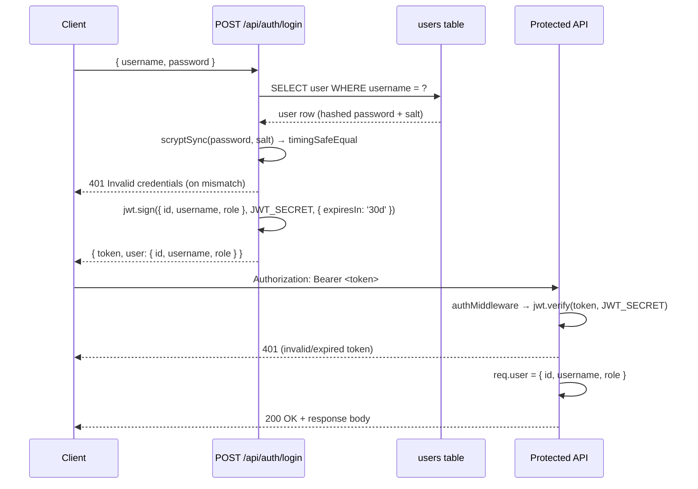

# Authentication & RBAC

Foundry-Git supports both an open development mode and a fully authenticated multi-user mode. Authentication is controlled by a single environment variable.

---

## Overview

`AUTH_ENABLED` is set at startup as:

```js
AUTH_ENABLED = !!process.env.FOUNDRY_ADMIN_PASSWORD
```

When `FOUNDRY_ADMIN_PASSWORD` is **not** set, `AUTH_ENABLED` is `false` and all API routes are unprotected. This is the default for local development. When the variable is set, every route (except the login and status endpoints) requires a valid JWT Bearer token.

---

## JWT Flow



### Token Details

| Property | Value |
|---|---|
| Algorithm | HS256 (HMAC-SHA256) |
| Expiry | 30 days |
| Header | `Authorization: Bearer <token>` |
| Secret source | `FOUNDRY_JWT_SECRET` env var (separate from `FOUNDRY_ADMIN_PASSWORD`) |

> **⚠️ Security Warning**: Two env vars control auth:
> - `FOUNDRY_ADMIN_PASSWORD` — enables auth and sets the admin password. Required to activate auth.
> - `FOUNDRY_JWT_SECRET` — secret used to sign tokens. If not set, falls back to `'foundry-dev-secret-change-in-prod'` and logs a `console.warn`. Always set this to a strong random value in production.

---

## Auth Middleware

`authMiddleware(req, res, next)` is applied globally to all `/api` routes:

```js
// backend/src/middleware/auth.js
export function authMiddleware(req, res, next) {
  if (!AUTH_ENABLED) return next();           // dev mode — skip entirely

  const header = req.headers.authorization;
  if (!header?.startsWith('Bearer ')) {
    return res.status(401).json({ error: 'Authorization header required' });
  }

  try {
    const token = header.slice(7);
    const decoded = jwt.verify(token, JWT_SECRET);
    req.user = { id: decoded.id, username: decoded.username, role: decoded.role };
    next();
  } catch {
    return res.status(401).json({ error: 'Invalid or expired token' });
  }
}
```

Public endpoints that are **exempt** from `authMiddleware`:

| Endpoint | Reason |
|---|---|
| `POST /api/auth/login` | Issues the token — must be unauthenticated |
| `GET /api/auth/status` | Lets clients detect whether auth is enabled |

---

## `requireAdmin()` Helper

Routes that need admin-only access call `requireAdmin` as a second middleware:

```js
export function requireAdmin(req, res, next) {
  if (req.user?.role !== 'admin') {
    return res.status(403).json({ error: 'Admin access required' });
  }
  next();
}
```

Example usage in a route file:

```js
router.delete('/users/:id', authMiddleware, requireAdmin, async (req, res) => { … });
```

---

## User Roles

| Role | Description | Typical Capabilities |
|---|---|---|
| `admin` | Full platform access | Create/delete workspaces, manage users, delete any resource |
| `member` | Standard operator | Create and run agents, manage boards, cards, flows |
| `viewer` | Read-only access | View agents, runs, boards; no mutations |

Roles are stored in the `users` table and embedded in the JWT payload. There is no role-elevation endpoint — role changes require a direct database update or admin API call.

---

## Password Hashing

Passwords are hashed with Node.js `crypto.scryptSync` and a random 16-byte salt:

```js
import { scryptSync, randomBytes, timingSafeEqual } from 'crypto';

// Hash on registration / password set
const salt = randomBytes(16).toString('hex');
const hash = scryptSync(password, salt, 64).toString('hex');
const stored = `${hash}:${salt}`;

// Verify on login
const [hash, salt] = stored.split(':');
const inputHash = scryptSync(input, salt, 64);
timingSafeEqual(inputHash, Buffer.from(hash, 'hex'));
```

`timingSafeEqual` prevents timing-based side-channel attacks.

---

## Legacy Admin Password Fallback

`POST /api/auth/login` also accepts the raw `FOUNDRY_ADMIN_PASSWORD` value as a password for the built-in `admin` account. This supports single-user deployments without a full users table entry:

```json
POST /api/auth/login
{ "username": "admin", "password": "<FOUNDRY_ADMIN_PASSWORD value>" }
```

When the users table is empty the server bootstraps a default `admin` user from this environment variable.

---

## Development Mode

When `FOUNDRY_ADMIN_PASSWORD` is **not** set:

- `AUTH_ENABLED = false`
- `authMiddleware` calls `next()` immediately for every request
- `req.user` is never populated — routes that read `req.user` should handle `undefined`
- No login is required; the frontend skips the login page

This mode is intended only for local development. **Never deploy to production without setting `FOUNDRY_ADMIN_PASSWORD`.**

---

## Token Expiry and Renewal

Tokens expire after **30 days**. There is no silent refresh mechanism. When a token expires:

1. The next API call returns `401 { "error": "Invalid or expired token" }`.
2. The frontend redirects to the login page.
3. The user logs in again to obtain a fresh token.

For long-lived automation (CI bots, scripts), store the token securely and re-authenticate before expiry.

---

## Protected vs Unprotected Routes

| Category | Protected? | Notes |
|---|---|---|
| `GET /api/auth/status` | ❌ No | Returns `{ authEnabled: bool }` |
| `POST /api/auth/login` | ❌ No | Issues JWT |
| All other `/api/*` routes | ✅ Yes (when `AUTH_ENABLED`) | Require `Bearer` token |
| Admin-only routes | ✅ Yes + `requireAdmin` | e.g. user management, workspace deletion |

---

## Related Documentation

- [Security Hardening](19-security-hardening.md) — rate limiting, Helmet headers, CORS, secrets management
- [API Reference](03-api-reference.md) — full list of endpoints and request/response schemas
- [Deployment Guide](15-deployment-guide.md) — environment variables, production checklist
