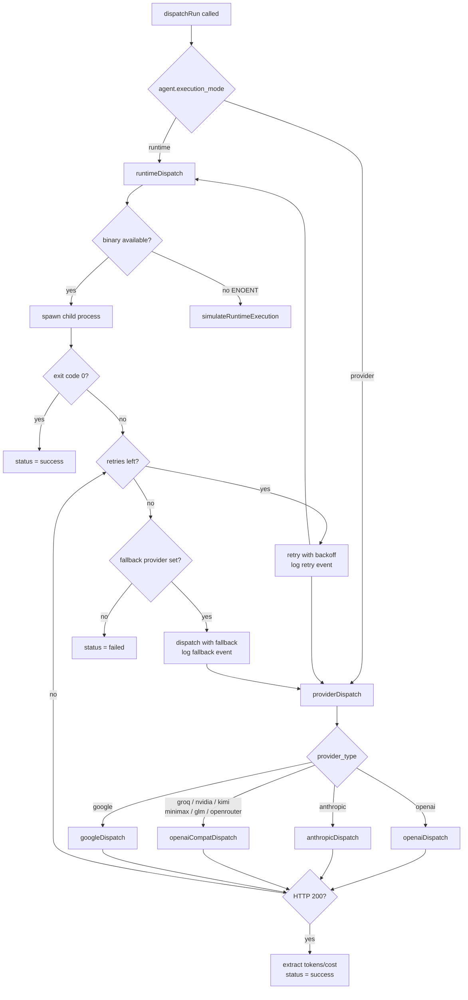

# Provider & Runtime Matrix

Foundry-Git supports two fundamentally different ways to execute an agent task: calling a cloud LLM **provider** via its HTTP API, or spawning a local CLI **runtime** as a subprocess. This document covers every supported provider and runtime, their configuration, and how the execution path is selected.

---

## Provider Types

LLM providers are configured in the `provider_configs` table. Each config stores the provider type, model, and credentials.

| Provider Type | Base URL | Env Var | Example Models | Notes |
|---|---|---|---|---|
| `openai` | `https://api.openai.com/v1` | `OPENAI_API_KEY` | `gpt-4o`, `gpt-4-turbo`, `gpt-3.5-turbo`, `o3`, `o4-mini` | Native OpenAI SDK path |
| `anthropic` | `https://api.anthropic.com` | `ANTHROPIC_API_KEY` | `claude-3-5-sonnet-20241022`, `claude-3-haiku-20240307` | Uses Anthropic messages API |
| `google` | `https://generativelanguage.googleapis.com` | `GOOGLE_API_KEY` | `gemini-1.5-pro`, `gemini-1.5-flash`, `gemini-2.0-flash` | Gemini generateContent API |
| `openrouter` | `https://openrouter.ai/api/v1` | `OPENROUTER_API_KEY` | Any model available on OpenRouter | OpenAI-compatible endpoint |
| `minimax` | `https://api.minimax.chat/v1` | `MINIMAX_API_KEY` | `abab6.5-chat`, `abab6.5s-chat` | OpenAI-compatible |
| `glm` | `https://open.bigmodel.cn/api/paas/v4` | `ZHIPU_API_KEY` | `glm-4`, `glm-4-flash`, `glm-4-air` | Zhipu AI / ChatGLM |
| `nvidia` | `https://integrate.api.nvidia.com/v1` | `NVIDIA_API_KEY` | `nvidia/llama-3.1-nemotron-70b-instruct` | NVIDIA NIM, OpenAI-compatible |
| `groq` | `https://api.groq.com/openai/v1` | `GROQ_API_KEY` | `llama3-70b-8192`, `mixtral-8x7b-32768`, `llama-3.3-70b-versatile` | OpenAI-compatible, fast inference |
| `kimi` | `https://api.moonshot.cn/v1` | `MOONSHOT_API_KEY` | `moonshot-v1-8k`, `moonshot-v1-32k`, `moonshot-v1-128k` | Moonshot AI |

### API Key Resolution

For each provider config, credentials are resolved in this order:

1. **`api_key` field** — key stored directly in the `provider_configs` row (masked as `api_key_set: true` in API responses; the raw value is never returned).
2. **`api_key_env_var` field** — name of an environment variable to read at dispatch time (e.g. `OPENAI_API_KEY`). This keeps secrets out of the database.
3. **`GITHUB_TOKEN`** — used automatically for GitHub-integrated operations when no other key is available.

If neither field yields a value, the dispatch attempt fails immediately with an appropriate error event.

### Provider Config Schema

```json
{
  "id": "uuid",
  "workspace_id": "uuid",
  "name": "My OpenAI Config",
  "provider_type": "openai",
  "base_url": null,
  "api_key_env_var": "OPENAI_API_KEY",
  "api_key_set": true,
  "model": "gpt-4o",
  "is_default": true
}
```

> `api_key` is write-only — `maskProvider()` strips it from every API response and replaces it with `api_key_set: boolean`.

---

## Runtime Types

Runtimes execute agent tasks by spawning a local CLI binary as a child process. The task prompt is passed as a CLI argument or via stdin depending on the runtime.

| Runtime Type | Default Binary | CLI Args Pattern | Description |
|---|---|---|---|
| `codex` | `codex` | `codex "<prompt>"` | OpenAI Codex CLI agent |
| `claude-code` | `claude` | `claude -p "<prompt>"` | Anthropic Claude Code (non-interactive) |
| `gemini-cli` | `gemini` | `gemini -p "<prompt>"` | Google Gemini CLI |
| `kimi-code` | `kimi` | prompt via stdin | Moonshot Kimi Code agent |
| `kilo-code` | `kilo` | prompt via stdin | Kilo Code agent |
| `opencode` | `opencode` | `opencode run "<prompt>"` | OpenCode agent |

### Runtime Config Schema

```json
{
  "id": "uuid",
  "workspace_id": "uuid",
  "name": "My Claude Code Runtime",
  "runtime_type": "claude-code",
  "binary_path": "/usr/local/bin/claude",
  "extra_args": "--no-color",
  "is_default": false
}
```

`binary_path` is validated against `/^[a-zA-Z0-9._\-/\\]+$/` before use to prevent command injection. When `binary_path` is empty, the runtime type name is used as the binary (resolved via `PATH`).

Use `GET /api/runtimes/:id/check` to verify a binary is available on the host before assigning it to an agent.

---

## Execution Mode Comparison

| Dimension | Provider Mode | Runtime Mode |
|---|---|---|
| **Mechanism** | HTTP API call to LLM cloud service | Subprocess spawn (`child_process.spawn`) |
| **Credentials** | API key (stored or env var) | Binary on host `PATH` or explicit `binary_path` |
| **Input** | `system_prompt` + task sent as chat messages | Task prompt as CLI arg or stdin |
| **Output** | JSON response body, parsed for content | `stdout` / `stderr` streamed to `run_events` |
| **Success criterion** | HTTP 200 + non-empty completion | Process exit code 0 |
| **Token tracking** | `tokens_input`, `tokens_output`, `cost_usd` recorded | Not applicable (no token metadata) |
| **Cost tracking** | Estimated from model pricing table | None |
| **Binary required** | No | Yes — binary must exist on host |
| **Fallback** | `fallback_provider_config_id` on failure | Simulated execution if binary not found (`ENOENT`) |
| **Best for** | Stateless completions, structured output | Agentic tasks needing file system / tool access |

---

## Fallback Provider Mechanism

Agents optionally specify a `fallback_provider_config_id`. When the primary provider fails after all retries, `dispatchRun()` automatically retries with the fallback config:

```
Primary provider → fails max_retries times
    └─→ fallback_provider_config_id set?
            ├─ Yes → dispatch with fallback config, log 'fallback' event
            └─ No  → mark run as 'failed'
```

The fallback must be a **provider** config (runtime fallback is not supported). A `fallback` event is written to `run_events` when the switch occurs.

---

## Execution Mode Decision Tree



---

## Related Documentation

- [Agent Configuration](09-agent-configuration.md) — how to assign a provider or runtime to an agent
- [Event & Run Lifecycle](06-event-and-run-lifecycle.md) — retry logic, timeout, and run event types
