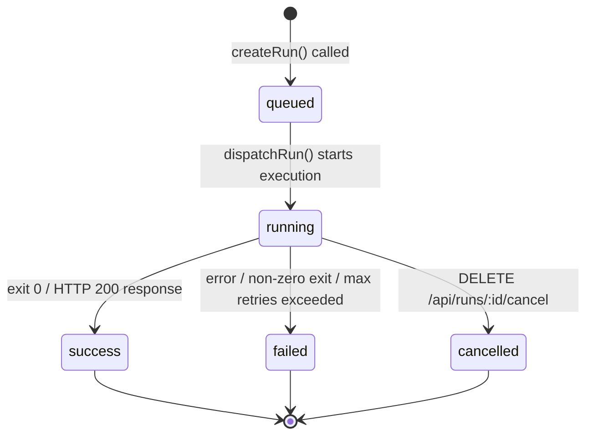
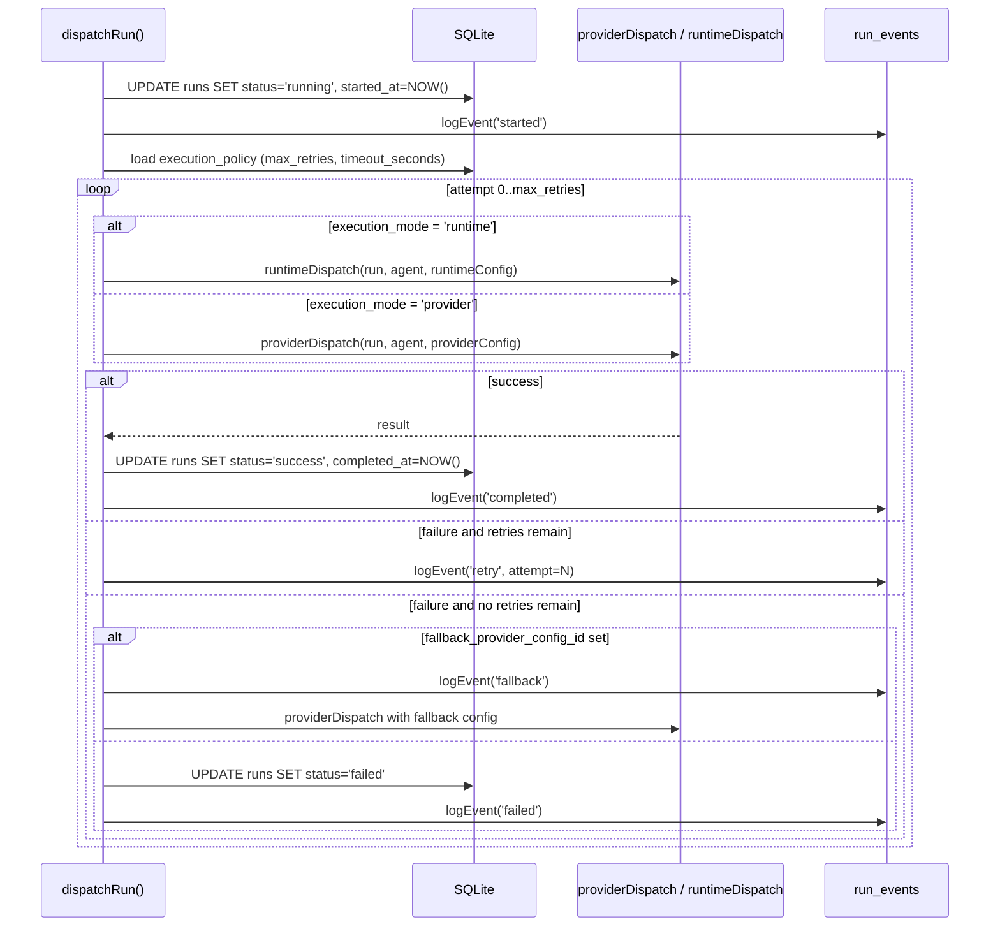
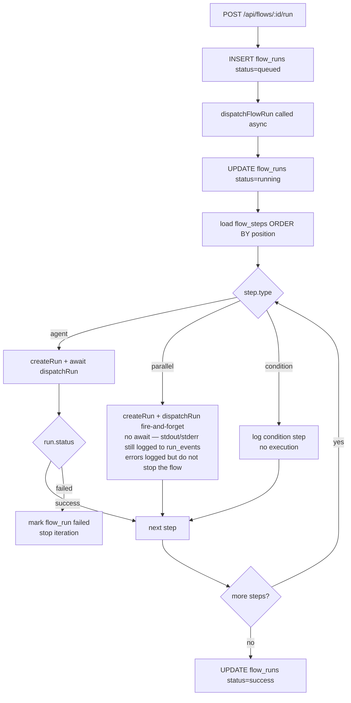

# Event & Run Lifecycle

This document describes the complete lifecycle of a run — from creation through dispatch, execution, event logging, and final state — for both single-agent runs and multi-step flow runs.

---

## Run State Machine



| State | Meaning |
|---|---|
| `queued` | Run record created, waiting for dispatch |
| `running` | Dispatch in progress (API call or subprocess alive) |
| `success` | Completed successfully |
| `failed` | Execution error after all retries |
| `cancelled` | Manually cancelled before or during execution |

---

## Run Creation Flow

```
POST /api/execute
  body: { card_id, agent_id, options? }
      │
      ▼
createRun(cardId, agentId, options)
  • INSERT INTO runs (status='queued', …)
  • logEvent(runId, 'created', …)
  • Returns run object
      │
      ▼
dispatchRun(runId)          ← called immediately, async (non-blocking)
  • Returns 201 { run } to caller right away
```

The HTTP response is returned before the run completes. Clients poll `GET /api/runs/:id` or subscribe to SSE events at `GET /api/runs/:id/events` for status updates.

---

## Dispatch Flow



---

## Provider Mode Dispatch

`providerDispatch(run, agent, providerConfig)` routes to a provider-specific handler:

| Provider Type | Handler | API Style |
|---|---|---|
| `openai` | `openaiDispatch` | OpenAI Chat Completions |
| `anthropic` | `anthropicDispatch` | Anthropic Messages API |
| `google` | `googleDispatch` | Gemini generateContent |
| `groq`, `nvidia`, `kimi`, `minimax`, `glm`, `openrouter` | `openaiCompatDispatch` | OpenAI-compatible |

All handlers:

1. Log a `provider_dispatch` event with provider type and model.
2. Build a messages array: system prompt + task prompt.
3. Call the provider HTTP endpoint.
4. Parse `tokens_input`, `tokens_output` from the response.
5. Estimate `cost_usd` from the built-in pricing table (40+ models, with a `$1/$3 per 1M tokens` fallback).
6. `UPDATE runs SET tokens_input=?, tokens_output=?, cost_usd=?`.
7. Log an `api_response` event with the first 500 chars of the completion.
8. Return the extracted text content.

---

## Runtime Mode Dispatch

`runtimeDispatch(run, agent, runtimeConfig)` spawns a CLI process:

```js
const child = spawn(binaryPath, args, {
  env: { ...process.env, ...runtimeEnv },
  stdio: ['pipe', 'pipe', 'pipe']
});

child.stdin.write(taskPrompt);
child.stdin.end();

child.stdout.on('data', chunk => logEvent(runId, 'stdout', chunk.toString()));
child.stderr.on('data', chunk => logEvent(runId, 'stderr', chunk.toString()));

child.on('close', code => {
  if (code === 0) resolve();
  else reject(new Error(`Exit code ${code}`));
});
```

CLI argument patterns per runtime:

| Runtime | Argument pattern |
|---|---|
| `claude-code` | `claude -p "<prompt>"` |
| `codex` | `codex "<prompt>"` |
| `gemini-cli` | `gemini -p "<prompt>"` |
| `opencode` | `opencode run "<prompt>"` |
| `kimi-code` | prompt written to stdin |
| `kilo-code` | prompt written to stdin |

When the binary is not found (`ENOENT` or `EACCES`), `simulateRuntimeExecution()` runs instead, producing a synthetic success response for testing purposes.

---

## Execution Policy

Each workspace has an `execution_policies` row (auto-created with defaults):

| Field | Default | Description |
|---|---|---|
| `max_retries` | `3` | Maximum retry attempts before marking failed |
| `timeout_seconds` | `300` | Per-attempt wall-clock timeout |
| `fallback_enabled` | `true` | Whether to attempt fallback provider on failure |

`withTimeout(promise, seconds)` wraps every dispatch attempt:

```js
function withTimeout(promise, seconds) {
  return Promise.race([
    promise,
    new Promise((_, reject) =>
      setTimeout(() => reject(new Error('Execution timeout')), seconds * 1000)
    )
  ]);
}
```

On timeout, a `timeout` event is logged and the attempt counts as a failure for retry purposes.

---

## Run Events

Every significant state change and output line is recorded in `run_events`:

```js
logEvent(runId, event_type, message, metadata_json?)
```

| Event Type | When logged |
|---|---|
| `created` | Run record inserted |
| `started` | Status changed to `running` |
| `runtime_dispatch` | Before spawning subprocess |
| `provider_dispatch` | Before HTTP API call |
| `api_call` | HTTP request sent to provider |
| `api_response` | HTTP response received |
| `stdout` | Line(s) from subprocess stdout |
| `stderr` | Line(s) from subprocess stderr |
| `retry` | Retrying after a failure (includes attempt number) |
| `fallback` | Switching to fallback provider |
| `timeout` | Attempt exceeded `timeout_seconds` |
| `completed` | Run finished successfully |
| `failed` | Run marked as failed |
| `cancelled` | Run cancelled by user |

---

## SSE Streaming

Subscribe to real-time run events without polling:

```
GET /api/runs/:id/events
Accept: text/event-stream
```

The server sends `data: <json>` frames for each new `run_events` row. The stream closes when the run reaches a terminal state (`success`, `failed`, or `cancelled`).

Example frame:

```
data: {"id":"…","run_id":"…","event_type":"stdout","message":"Analyzing code…","created_at":"…"}
```

---

## Token and Cost Tracking

Each run row stores:

| Column | Type | Description |
|---|---|---|
| `tokens_input` | INTEGER | Prompt tokens consumed |
| `tokens_output` | INTEGER | Completion tokens generated |
| `cost_usd` | REAL | Estimated cost in USD |

Cost is estimated using a table of ~40 model prices. For unlisted models, the fallback is `$1.00 / 1M input` + `$3.00 / 1M output`. Runtime runs do not track tokens or cost (no token metadata is available from subprocess output).

---

## Flow Run Lifecycle

A flow run orchestrates multiple agent runs through steps defined in `flow_steps`.



### Step Types

| Type | Behaviour |
|---|---|
| `agent` | Blocking — the flow waits for the agent run to complete before continuing. A failure stops the flow. |
| `parallel` | Fire-and-forget — the run is dispatched concurrently and the flow moves to the next step immediately. The run's `stdout`, `stderr`, and status events are still written to `run_events` and can be monitored via `GET /api/runs/:id/events`. A parallel step failure does **not** stop the flow. |
| `condition` | Informational only — no agent run is created. Used as decision nodes in the visual editor. |

### Flow Run States

Flow runs follow the same `queued → running → success/failed/cancelled` state machine as individual runs.

---

## Related Documentation

- [Agent Configuration](09-agent-configuration.md) — execution mode, provider/runtime assignment
- [Flow Builder](11-flow-builder.md) — visual flow editor and step configuration
- [API Reference](03-api-reference.md) — `/api/execute`, `/api/runs`, `/api/flows/:id/run` endpoints
