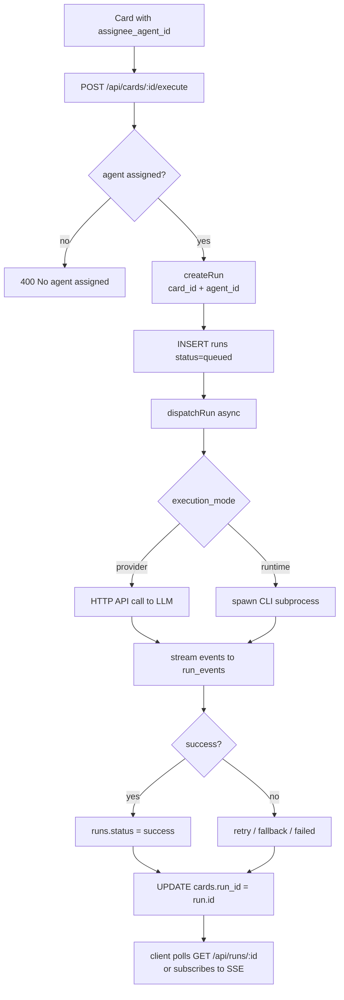

# Board & Card Workflow

Boards provide a kanban-style interface for managing work within a project. Cards represent discrete tasks and can be assigned to AI agents, linked to GitHub issues, and executed with a single API call.

---

## Board Overview

A board belongs to exactly one project and organises work into ordered columns. Multiple boards can exist per project (e.g. one per sprint or workstream).

### Schema

| Column | Type | Notes |
|---|---|---|
| `id` | TEXT (UUID) | Primary key |
| `project_id` | TEXT | FK → projects.id |
| `name` | TEXT | Board name (e.g. "Sprint 3") |
| `created_at` | DATETIME | Auto-set |
| `updated_at` | DATETIME | Auto-updated |

---

## Board Columns

Each board has an ordered list of columns. Columns are positioned with an integer `position` field and can be reordered via drag-and-drop in the UI.

### Default Columns

| Position | Name |
|---|---|
| 1 | Backlog |
| 2 | Todo |
| 3 | In Progress |
| 4 | In Review |
| 5 | Done |

### Column Schema

| Column | Type | Notes |
|---|---|---|
| `id` | TEXT (UUID) | Primary key |
| `board_id` | TEXT | FK → boards.id |
| `name` | TEXT | Column title |
| `position` | INTEGER | Sort order (1-based) |

Reorder columns with:

```http
PUT /api/boards/:boardId/columns/:columnId
{ "position": 2 }
```

---

## Card Overview

A card is a task or issue on a board column. It can be assigned to an AI agent, linked to a GitHub issue, and executed to produce a run.

### Schema

| Column | Type | Notes |
|---|---|---|
| `id` | TEXT (UUID) | Primary key |
| `board_id` | TEXT | FK → boards.id |
| `column_id` | TEXT | FK → board_columns.id |
| `title` | TEXT | Card title (used as task prompt headline) |
| `description` | TEXT | Full task description |
| `status` | TEXT | See status table below |
| `priority` | TEXT | See priority table below |
| `assignee_agent_id` | TEXT | FK → agents.id (nullable) |
| `run_id` | TEXT | FK → runs.id — latest run for this card (nullable) |
| `github_issue_number` | INTEGER | Linked GitHub issue number (nullable) |
| `github_issue_url` | TEXT | GitHub issue HTML URL (nullable) |
| `position` | INTEGER | Sort order within column |
| `created_at` | DATETIME | Auto-set |
| `updated_at` | DATETIME | Auto-updated |

---

## Card Statuses

| Status | Display Colour | Meaning |
|---|---|---|
| `todo` | Grey | Not started |
| `in_progress` | Blue | Actively being worked on |
| `in_review` | Purple | Under review |
| `done` | Green | Completed |
| `cancelled` | Red | Abandoned |

---

## Card Priority Levels

| Priority | Display Colour | Meaning |
|---|---|---|
| `low` | Grey | Nice-to-have |
| `medium` | Yellow | Normal work item |
| `high` | Orange | Elevated urgency |
| `critical` | Red | Must be addressed immediately |

---

## GitHub Issue Linking

Cards can be bidirectionally linked to GitHub issues:

- `github_issue_number` — the integer issue number in the linked repository
- `github_issue_url` — the full HTML URL for direct linking from the UI

### Sync Flow

1. Trigger a sync from the project settings or via `POST /api/github/sync/:projectId`.
2. The GitHub service fetches open issues for the project's `repo_owner/repo_name`.
3. For each issue:
   - If a card with matching `github_issue_number` exists → update title/description.
   - Otherwise → create a new card in the **Backlog** column.

Cards created this way inherit the issue title and body as `title` and `description`.

---

## Agent Assignment

Assign an AI agent to a card to designate which agent will execute the task:

```http
PUT /api/cards/:id
{ "assignee_agent_id": "agent_01J…" }
```

When execution is triggered, the card's `title` and `description` are combined into a task prompt and passed to the assigned agent.

---

## Card Execution

Trigger a run for a card's assigned agent:

```http
POST /api/cards/:id/execute
```

Internally this calls:

```
POST /api/execute  { card_id, agent_id: card.assignee_agent_id }
```

The returned `run.id` is stored in `cards.run_id` so the card always references its latest run.

### Card Execution Flow



---

## Run Tracking

`cards.run_id` always points to the **most recent run** for the card. To see the full run history for a card:

```http
GET /api/runs?card_id=<cardId>
```

To stream live events during execution:

```http
GET /api/runs/:runId/events
Accept: text/event-stream
```

---

## Board UI

The board page renders each column as a vertical lane. Cards are displayed as tiles with title, priority badge, status indicator, assigned agent avatar, and GitHub issue link (if set).

**Interactions:**
- Drag a card between columns to update its `column_id` and `position`.
- Click a card to open the detail panel (description, run history, events).
- Click **Run** on a card to trigger execution without leaving the board.

---

## Creating Cards from GitHub Issues

1. Open the project's **Settings** tab.
2. Click **Sync GitHub Issues**.
3. New cards appear in the **Backlog** column with the issue title and description pre-filled.
4. Assign an agent to the card, then click **Run** to begin execution.

---

## API Examples

```http
# Create a card
POST /api/cards
{
  "board_id": "board_01J…",
  "column_id": "col_01J…",
  "title": "Fix authentication bug",
  "description": "JWT tokens expire prematurely on mobile clients.",
  "priority": "high",
  "assignee_agent_id": "agent_01J…"
}

# Move a card to a different column
PUT /api/cards/:id
{ "column_id": "col_02J…", "status": "in_progress" }

# Execute the card
POST /api/cards/:id/execute

# Get all cards on a board
GET /api/cards?board_id=board_01J…
```

---

## Related Documentation

- [Agent Configuration](09-agent-configuration.md) — setting up agents to assign to cards
- [Event & Run Lifecycle](06-event-and-run-lifecycle.md) — run states, event streaming, retry logic
- [GitHub Integration](13-github-integration.md) — issue sync, webhook-triggered execution
