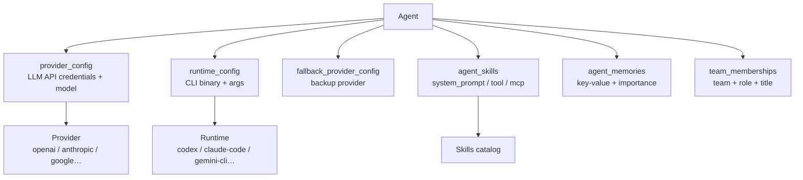

# Agent Configuration

Agents are the AI entities that perform work in Foundry-Git. Each agent encapsulates a provider or runtime configuration, a system prompt, optional skills, and budget limits.

---

## Agent Overview

An agent combines:

- **An identity** — name, description, workspace membership
- **An execution target** — either an LLM provider API or a local CLI runtime
- **A system prompt** — permanent instructions prepended to every task
- **Skills** — reusable prompt, tool, or MCP extensions
- **Budget controls** — monthly USD spend cap
- **A fallback** — secondary provider for resilience

---

## Agent Schema

| Column | Type | Notes |
|---|---|---|
| `id` | TEXT (UUID) | Primary key |
| `workspace_id` | TEXT | FK → workspaces.id |
| `name` | TEXT | Display name |
| `description` | TEXT | Purpose / specialisation summary |
| `provider_config_id` | TEXT | FK → provider_configs.id (nullable) |
| `runtime_config_id` | TEXT | FK → runtime_configs.id (nullable) |
| `execution_mode` | TEXT | `'provider'` or `'runtime'` |
| `fallback_provider_config_id` | TEXT | FK → provider_configs.id (nullable) |
| `system_prompt` | TEXT | Instructions prepended to every task |
| `monthly_budget_usd` | REAL | Spend cap in USD (nullable = unlimited) |
| `created_at` | DATETIME | Auto-set |
| `updated_at` | DATETIME | Auto-updated |

---

## Execution Mode Selection

| Use `provider` when… | Use `runtime` when… |
|---|---|
| You need structured JSON output | The task requires file system access |
| You want token/cost tracking | The task uses a tool-enabled CLI agent |
| The task is a stateless completion | You want the full agentic loop (think → act → observe) |
| You prefer not to install binaries on the host | You have Claude Code / Codex / Gemini CLI available |

Set `execution_mode` at creation time or update it later. The matching config field must also be set: `provider_config_id` for `'provider'` mode, `runtime_config_id` for `'runtime'` mode.

---

## Provider Mode Setup

1. Create a provider config at `POST /api/providers` (see [Provider & Runtime Matrix](05-provider-runtime-matrix.md)).
2. Create the agent with `execution_mode: 'provider'` and `provider_config_id` pointing to the config.
3. The model is determined by the provider config's `model` field.

```http
POST /api/agents
{
  "workspace_id": "ws_01J…",
  "name": "Code Reviewer",
  "execution_mode": "provider",
  "provider_config_id": "prov_01J…",
  "system_prompt": "You are an expert code reviewer…"
}
```

---

## Runtime Mode Setup

1. Install the target CLI binary on the host (e.g. `npm install -g @anthropic-ai/claude-code`).
2. Create a runtime config at `POST /api/runtimes` with `runtime_type` and optional `binary_path`.
3. Create the agent with `execution_mode: 'runtime'` and `runtime_config_id`.

```http
POST /api/agents
{
  "workspace_id": "ws_01J…",
  "name": "Autonomous Coder",
  "execution_mode": "runtime",
  "runtime_config_id": "rt_01J…",
  "system_prompt": "You write clean, tested code."
}
```

Use `GET /api/runtimes/:id/check` to verify the binary is accessible before assigning the runtime config.

---

## System Prompt

The system prompt is prepended to every task dispatched to the agent. It sets the agent's persona, constraints, output format, and domain expertise.

### Best Practices

- **Be specific about role**: `"You are a senior Go engineer specialising in distributed systems."` outperforms generic instructions.
- **Define output format**: Specify JSON, markdown, or plain text if downstream tools depend on it.
- **Set constraints**: `"Never suggest adding new dependencies."` or `"Always include unit tests."`.
- **Keep it focused**: Overly long prompts dilute the core instruction. Prefer skills for additive capabilities (see below).
- **Use first person**: Models respond better to direct instructions than third-person descriptions.

---

## Skills Attachment

Skills extend an agent's capabilities and are stored in the `agent_skills` join table. Three skill types are supported:

| Skill Type | Effect |
|---|---|
| `system_prompt` | Additional instructions appended to the agent's system prompt at dispatch time |
| `tool` | JSON tool definition made available to the model during the API call |
| `mcp` | Model Context Protocol server configuration, enabling external tool calls |

Attach a skill to an agent:

```http
POST /api/skills/:skillId/agents
{ "agent_id": "agent_01J…" }
```

Remove a skill:

```http
DELETE /api/skills/:skillId/agents/:agentId
```

List skills attached to an agent:

```http
GET /api/agents/:id/skills
```

---

## Agent Memory

Agents have a persistent key-value store in `agent_memories`. Memory entries are available as context in future runs for the same agent.

| Column | Type | Notes |
|---|---|---|
| `id` | TEXT (UUID) | Primary key |
| `agent_id` | TEXT | FK → agents.id |
| `workspace_id` | TEXT | FK → workspaces.id |
| `memory_key` | TEXT | Memory key |
| `content` | TEXT | Memory value |
| `session_id` | TEXT | Optional session scope (nullable) |
| `importance` | INTEGER | 1 (low) – 5 (critical) |
| `created_at` | DATETIME | Auto-set |
| `updated_at` | DATETIME | Auto-updated |

Use importance levels to prioritise what gets surfaced in context windows:

| Level | Meaning |
|---|---|
| 1 | Ephemeral preference |
| 2 | Useful context |
| 3 | Relevant fact |
| 4 | Important constraint |
| 5 | Critical rule |

---

## Monthly Budget

Set `monthly_budget_usd` to cap the total cost for an agent across all runs in a calendar month:

```http
PUT /api/agents/:id
{ "monthly_budget_usd": 50.00 }
```

Budget consumption is tracked by aggregating `cost_usd` from all runs for the agent within the current month. When the budget is exceeded, new runs fail immediately with a budget error event. Set to `null` for unlimited spend.

---

## Fallback Provider

Set `fallback_provider_config_id` to designate a secondary provider for resilience:

```http
PUT /api/agents/:id
{ "fallback_provider_config_id": "prov_backup_01J…" }
```

When the primary provider fails after all retries, `dispatchRun()` automatically switches to the fallback config and logs a `fallback` event. See [Event & Run Lifecycle](06-event-and-run-lifecycle.md) for the full retry/fallback flow.

---

## Agent Templates

Foundry-Git ships with 12 pre-configured agent templates to accelerate setup:

| Template | Specialisation | Recommended Mode |
|---|---|---|
| Code Reviewer | OWASP, performance, security code review | provider |
| Test Writer | Unit and integration test generation | provider |
| Architect | System design and ADR authoring | provider |
| DevOps | CI/CD, infrastructure, deployment automation | runtime |
| Product Manager | Spec writing, prioritisation, roadmaps | provider |
| Tech Writer | Documentation, READMEs, API docs | provider |
| Security Auditor | Vulnerability analysis, OWASP Top 10 | provider |
| Data Analyst | Data processing, insight extraction | provider |
| Researcher | Multi-source synthesis, citations | provider |
| UX/UI Designer | Accessibility, responsive design, design systems | provider |
| Orchestrator | Multi-agent coordination and delegation | provider |
| Browser Agent | Web navigation, scraping, form interaction | runtime |

Create an agent from a template:

```http
POST /api/agents/from-template
{ "template_id": "code-reviewer", "workspace_id": "ws_01J…", "name": "PR Reviewer" }
```

---

## Agent Configuration Relationships



---

## Team Membership

Agents are assigned to teams via `team_memberships`. A single agent can belong to multiple teams with different roles. See [Team Hierarchy](10-team-hierarchy.md) for details.

---

## Related Documentation

- [Provider & Runtime Matrix](05-provider-runtime-matrix.md) — supported providers, runtimes, and API key setup
- [Team Hierarchy](10-team-hierarchy.md) — organising agents into teams
- [MCP & Skills](14-mcp-and-skills.md) — skills catalog, MCP server configuration
