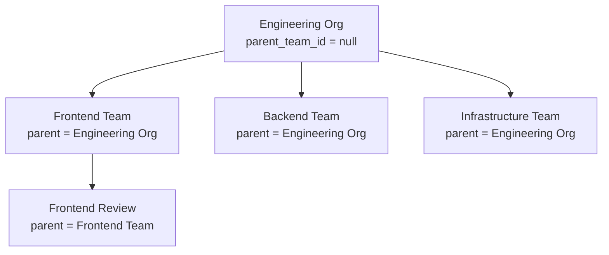
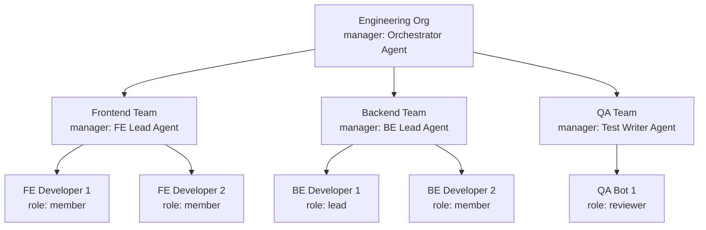

# Team Hierarchy

Teams allow you to organise agents into groups with optional hierarchical nesting. Teams can be assigned to projects, enabling scoped access and coordination across large workspaces.

---

## Team Overview

A team is a named group of agents within a workspace. Teams support:

- **Hierarchy** — parent/child team nesting via `parent_team_id`
- **Manager agent** — a designated coordinating agent via `manager_agent_id`
- **Membership roles** — per-member `role` and `title` within the team
- **Project assignment** — teams linked to projects via `project_teams`

---

## Team Schema

| Column | Type | Notes |
|---|---|---|
| `id` | TEXT (UUID) | Primary key |
| `workspace_id` | TEXT | FK → workspaces.id |
| `name` | TEXT | Team display name |
| `description` | TEXT | Team purpose / charter |
| `parent_team_id` | TEXT | FK → teams.id (nullable, self-referential) |
| `manager_agent_id` | TEXT | FK → agents.id (nullable) |
| `created_at` | DATETIME | Auto-set |
| `updated_at` | DATETIME | Auto-updated |

---

## Hierarchical Teams

The `parent_team_id` self-referential FK enables nested team structures of arbitrary depth. Sub-teams inherit project associations from their parent — if a parent team is assigned to a project, all child teams are also considered part of that project.



Creating a sub-team:

```http
POST /api/teams
{
  "workspace_id": "ws_01J…",
  "name": "Frontend Review",
  "parent_team_id": "team_fe_01J…"
}
```

---

## Manager Agent

`manager_agent_id` designates a specific agent as the team's coordinator. This is a semantic field — the platform does not enforce any special dispatch behaviour for the manager. It is used by orchestration flows and UI displays to identify the primary coordinating agent for a team.

Common uses:
- An **Orchestrator** agent that breaks down tasks and delegates to member agents.
- A **Product Manager** agent that reviews output from developer agents.

```http
POST /api/teams
{
  "workspace_id": "ws_01J…",
  "name": "Feature Team Alpha",
  "manager_agent_id": "agent_orchestrator_01J…"
}
```

---

## Team Memberships

Agents are added to teams via the `team_memberships` join table:

| Column | Type | Notes |
|---|---|---|
| `team_id` | TEXT | FK → teams.id |
| `agent_id` | TEXT | FK → agents.id |
| `role` | TEXT | e.g. `'member'`, `'lead'`, `'reviewer'` |
| `title` | TEXT | Human-readable title (e.g. "Senior Engineer") |

`UNIQUE(team_id, agent_id)` prevents duplicate memberships.

### Managing Memberships

```http
# Add an agent to a team
POST /api/teams/:teamId/members
{
  "agent_id": "agent_01J…",
  "role": "lead",
  "title": "Tech Lead"
}

# List members of a team
GET /api/teams/:teamId/members

# Update membership role or title
PUT /api/teams/:teamId/members/:agentId
{ "role": "member", "title": "Engineer" }

# Remove an agent from a team
DELETE /api/teams/:teamId/members/:agentId
```

### Membership Roles

`role` and `title` are free-text fields — there are no predefined enum values. Common conventions:

| Role | Typical Use |
|---|---|
| `member` | Standard team member |
| `lead` | Technical or domain lead |
| `reviewer` | Dedicated review / QA agent |
| `manager` | Same agent as `manager_agent_id`, modelled as a member too |

---

## Project–Team Associations

Teams are linked to projects through the `project_teams` table, giving team members access to that project's boards and cards.

```http
# Assign a team to a project
POST /api/projects/:projectId/teams
{ "team_id": "team_01J…" }

# List teams assigned to a project
GET /api/projects/:projectId/teams

# Remove a team from a project
DELETE /api/projects/:projectId/teams/:teamId
```

---

## Team CRUD

```http
# Create a team
POST /api/teams
{
  "workspace_id": "ws_01J…",
  "name": "Data Platform",
  "description": "Owns data pipelines and analytics infrastructure",
  "parent_team_id": null,
  "manager_agent_id": "agent_arch_01J…"
}

# List all teams in a workspace
GET /api/teams?workspace_id=ws_01J…

# Get a single team (includes members)
GET /api/teams/:id

# Update team
PUT /api/teams/:id
{ "name": "Data & Analytics Platform", "manager_agent_id": "agent_new_01J…" }

# Delete team (removes memberships and project associations)
DELETE /api/teams/:id
```

---

## Use Cases

| Team Type | Structure | Example |
|---|---|---|
| **Feature team** | Flat — developer agents + reviewer agent | `Backend Feature Team`: 3 coders + 1 reviewer |
| **Ops team** | Flat — DevOps + security agents | `Platform Ops`: CI/CD agent + Security Auditor |
| **Review team** | Flat — specialised reviewers | `Code Review Pool`: 2 code reviewers + 1 security auditor |
| **Cross-functional** | Hierarchical — sub-teams per discipline | `Product Delivery` → `Engineering` + `QA` + `Docs` |
| **Org unit** | Hierarchical — mirrors org chart | `Engineering Org` → `Frontend` + `Backend` + `Infra` |

---

## Full Hierarchy Example



---

## Related Documentation

- [Agent Configuration](09-agent-configuration.md) — creating agents to add as team members
- [Workspace & Project Guide](07-workspace-and-project-guide.md) — assigning teams to projects
