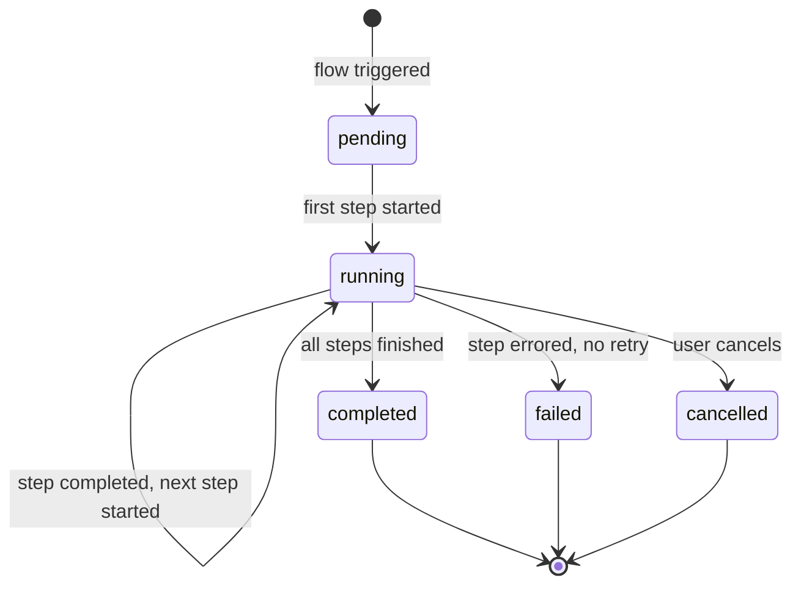
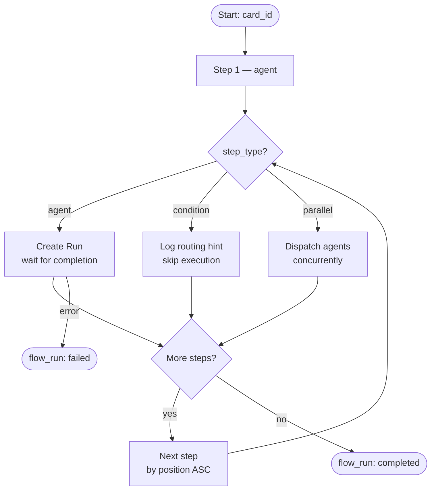

# Flow Builder

Flows are multi-step workflows that orchestrate agents against cards in a defined sequence. Each flow contains an ordered list of steps; executing a flow creates a `flow_run` that progresses through those steps.

Cross-references: [Event & Run Lifecycle](06-event-and-run-lifecycle.md) · [Agent Configuration](09-agent-configuration.md)

---

## Flow Overview

A **flow** is a reusable pipeline composed of sequential steps. Each step can invoke an agent against a card, branch conditionally, or fan out to multiple agents in parallel. Flows can be created from scratch or instantiated from one of the built-in templates.

---

## Flow Fields

| Field | Type | Description |
|---|---|---|
| `id` | TEXT (UUID) | Primary key |
| `workspace_id` | TEXT | Owning workspace |
| `project_id` | TEXT | Optional — scopes the flow to a project |
| `name` | TEXT | Human-readable name |
| `description` | TEXT | Optional long-form description |
| `status` | TEXT | `draft` · `active` · `archived` |

---

## Flow Step Types

### `agent`
Executes an assigned agent against a card. Creates a `Run`, waits for completion (or fires-and-forgets in parallel mode), and records the result before moving to the next step.

### `condition`
An informational routing hint. Describes a branching rule in natural language but performs no automated execution. Use it to annotate decision points in a flow for human review or future automation.

### `parallel`
Dispatches multiple agents concurrently in fire-and-forget mode. All parallel agents are started simultaneously; the flow does not wait for them to complete before continuing.

---

## Flow Step Fields

| Field | Type | Description |
|---|---|---|
| `id` | TEXT (UUID) | Primary key |
| `flow_id` | TEXT | Parent flow |
| `agent_id` | TEXT | Agent to run (optional for `condition` steps) |
| `name` | TEXT | Step label |
| `step_type` | TEXT | `agent` · `condition` · `parallel` |
| `position` | INTEGER | Execution order (ascending) |
| `config_json` | TEXT | JSON — extra configuration (e.g. parallel agent list) |

Steps are executed in **ascending `position` order**. Gaps in position values are allowed and are useful for later insertion.

---

## Creating a Flow

### Via the UI

1. Navigate to **Flows** in the sidebar.
2. Click **New Flow** and fill in the name, optional description, and target project.
3. Set status to `draft` while building; change to `active` when ready to execute.

### Via API

```http
POST /api/flows
Content-Type: application/json

{
  "workspace_id": "ws-abc123",
  "project_id": "proj-xyz",
  "name": "My Pipeline",
  "description": "Runs code review then tests",
  "status": "draft"
}
```

Response includes the new flow `id`.

---

## Adding Steps

```http
POST /api/flows/:id/steps
Content-Type: application/json

{
  "name": "Security Audit",
  "step_type": "agent",
  "agent_id": "agent-security",
  "position": 10
}
```

Reorder existing steps with:

```http
PUT /api/flows/:id/steps/reorder
Content-Type: application/json

{ "steps": [{ "id": "step-1", "position": 10 }, { "id": "step-2", "position": 20 }] }
```

---

## Flow Templates

Six templates are available out of the box. Each template creates a complete flow with pre-configured steps.

| Template ID | Name | Steps |
|---|---|---|
| `tpl-flow-code-review` | Automated Code Review | Security Audit → Code Quality Review → Test Coverage Analysis → Summary Report |
| `tpl-flow-feature-dev` | Feature Development | Write Specification → Implement Feature → Write Tests → Update Documentation |
| `tpl-flow-research` | Deep Research | Define Research Scope → Information Gathering (parallel) → Analysis & Synthesis → Report Writing |
| `tpl-flow-incident-response` | Incident Response | Assess Impact → Root Cause Analysis → Implement Fix → Post-Mortem Report |
| `tpl-flow-content-pipeline` | Content Creation Pipeline | Research Topic → Create Outline → Write Draft → Review & Edit |
| `tpl-flow-data-pipeline` | Data Analysis Pipeline | Data Ingestion → Data Cleaning → Analysis (parallel) → Insight Report |

List available templates:

```http
GET /api/flows/templates
```

---

## Creating a Flow from a Template

```http
POST /api/flows/from-template
Content-Type: application/json

{
  "template_id": "tpl-flow-code-review",
  "workspace_id": "ws-abc123",
  "project_id": "proj-xyz"
}
```

The response contains the newly created flow with all steps pre-populated at evenly spaced `position` values.

---

## Executing a Flow

```http
POST /api/flows/:id/run
Content-Type: application/json

{
  "card_id": "card-abc"
}
```

This creates a `flow_run` record and begins step execution. A `Run` is created for each `agent` step.

List historical runs for a flow:

```http
GET /api/flows/:id/runs
```

---

## Flow Run Tracking

Flow execution state is recorded in `flow_runs`.

| Field | Description |
|---|---|
| `id` | UUID of this run |
| `flow_id` | Parent flow |
| `card_id` | Card being processed |
| `status` | Current status (see state machine below) |
| `current_step_id` | Step currently executing |
| `started_at` / `completed_at` | Timestamps |

### Flow Run Status Machine



---

## Flow Execution Diagram


