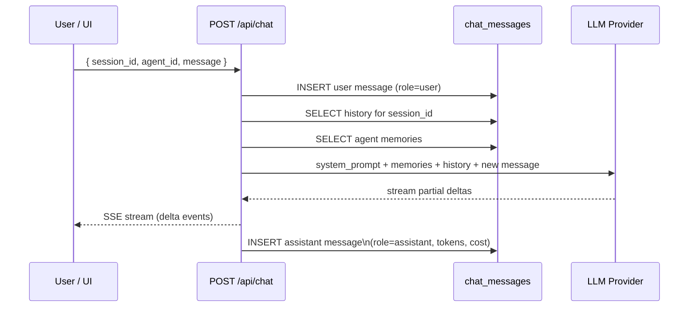

# Chat Interface

The chat interface provides a conversational layer on top of any agent. Messages are persisted in the `chat_messages` table, grouped into sessions, and include full token and cost accounting.

Cross-references: [Agent Configuration](09-agent-configuration.md) · [Provider & Runtime Matrix](05-provider-runtime-matrix.md)

---

## Overview

Each chat session is a back-and-forth exchange between a user and an agent-backed AI. The backend streams the response in real time, records every message, and injects relevant context (agent memories, conversation history) into the LLM call.

---

## Session Model

Sessions are not stored in a separate table. A **session** is identified by a `session_id` string that groups related `chat_messages` rows. When you send the first message you choose (or generate) a `session_id`; all subsequent messages in the same conversation use the same value.

---

## Chat Message Fields

| Field | Type | Description |
|---|---|---|
| `id` | TEXT (UUID) | Primary key |
| `workspace_id` | TEXT | Owning workspace |
| `agent_id` | TEXT | Agent that handled the message |
| `role` | TEXT | `user` · `assistant` · `system` |
| `content` | TEXT | Message text |
| `session_id` | TEXT | Groups messages into a conversation |
| `tokens_input` | INTEGER | Prompt tokens used |
| `tokens_output` | INTEGER | Completion tokens generated |
| `cost_usd` | REAL | Estimated cost in USD |
| `metadata_json` | TEXT | JSON — overrides and extended options (see below) |

---

## Starting a Session

Send the first user message. If the `session_id` is new, a session is implicitly created; if it already exists, the message is appended to the ongoing conversation.

```http
POST /api/chat
Content-Type: application/json

{
  "workspace_id": "ws-abc123",
  "agent_id": "agent-xyz",
  "session_id": "session-20240601-001",
  "message": "Summarise the open issues in this sprint.",
  "metadata_json": {}
}
```

The response streams the assistant reply via Server-Sent Events (see [Streaming Responses](#streaming-responses)).

---

## Message History

Retrieve all messages belonging to a session in chronological order:

```http
GET /api/chat/sessions/:sessionId
```

---

## Session List

List recent sessions (distinct `session_id` values) for a workspace:

```http
GET /api/chat/sessions
```

---

## Agent Selection

Each chat message targets a specific `agent_id`. The agent's system prompt, attached skills, and memory context are all applied to the LLM call. You can switch agents between messages in the same session, though the full conversation history is always sent as context.

---

## Provider and Model Override

Add a `metadata_json` payload to override the agent's default provider or model for a single message:

```json
{
  "provider_override": "anthropic",
  "model_override": "claude-opus-4-5"
}
```

This is useful for one-off experiments without permanently changing the agent's configuration.

---

## Reasoning Levels

For providers that support extended thinking (e.g. Anthropic Claude), you can request deeper reasoning via `metadata_json`:

```json
{
  "reasoning": "high"
}
```

Accepted values are provider-dependent (e.g. `low`, `medium`, `high`).

---

## Plan Mode

Setting `plan_mode: true` in `metadata_json` instructs the agent to decompose the request into a task plan before executing. The plan is returned as the assistant message; no runs are dispatched until the user approves.

```json
{
  "plan_mode": true
}
```

---

## Memory Context Injection

Agent memories stored in `agent_memories` are automatically retrieved and injected into the system prompt before the LLM call. This gives the agent persistent awareness of facts it has learned across sessions.

---

## Conversation History

All prior messages in the session are sent to the LLM as context on every request (up to provider context-window limits). Older messages are not truncated by Foundry — if your conversation grows very long, consider starting a new session.

---

## Token and Cost Tracking

Every assistant message records:

- `tokens_input` — tokens consumed by the prompt (system + history + new user message)
- `tokens_output` — tokens in the generated reply
- `cost_usd` — estimated cost computed from the provider's published rates

Aggregate costs across a workspace are available via `GET /api/settings/cost-summary`.

---

## Streaming Responses

The `POST /api/chat` endpoint returns a **Server-Sent Events** stream. Each event contains a partial text delta. The stream ends with a `[DONE]` sentinel.

```
data: {"delta": "Here is "}
data: {"delta": "the summary..."}
data: [DONE]
```

Clients should accumulate deltas and display them as they arrive.

---

## Chat Message Flow


