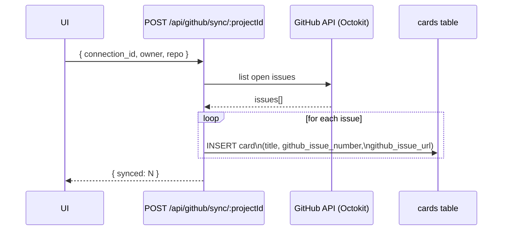
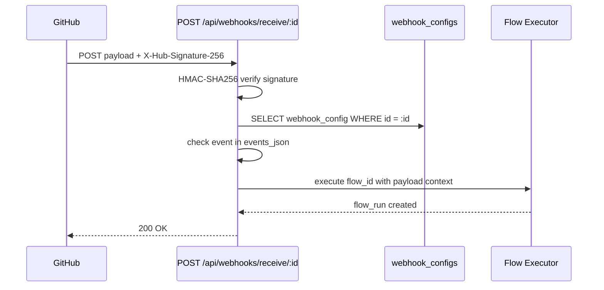

# GitHub Integration

Foundry-Git connects to GitHub via the Octokit library, supporting both Personal Access Tokens (PAT) and GitHub Apps. One or more connections can be configured per workspace.

Cross-references: [Workspace & Project Guide](07-workspace-and-project-guide.md) · [Webhook System](25-webhook-system.md) · [Board & Card Workflow](08-board-and-card-workflow.md)

---

## Overview

GitHub connections are stored in `github_connections`, scoped to a workspace. A connection holds either a PAT (referenced by an environment-variable name so the token is never stored in the database) or GitHub App credentials. The integration supports issue sync, repository inspection, branch creation, and pull request creation, as well as receiving inbound webhook events.

---

## GitHub Connection Fields

| Field | Type | Description |
|---|---|---|
| `id` | TEXT (UUID) | Primary key |
| `workspace_id` | TEXT | Owning workspace |
| `name` | TEXT | Friendly label |
| `access_token_env_var` | TEXT | Name of the env var that holds the PAT (e.g. `GITHUB_TOKEN`) |
| `installation_id` | TEXT | GitHub App installation ID (App auth only) |
| `app_id` | TEXT | GitHub App ID (App auth only) |
| `is_default` | INTEGER | `1` if this is the workspace default connection |

---

## Connection Types

### Personal Access Token

Set `access_token_env_var` to the name of an environment variable that contains the token. The token value is read at runtime and never written to the database.

```json
{
  "name": "My PAT",
  "access_token_env_var": "GITHUB_TOKEN"
}
```

The `GITHUB_TOKEN` environment variable also acts as a **global fallback** when no connection is explicitly configured.

### GitHub App

Provide `app_id` and `installation_id`. The private key path is configured via the `GITHUB_APP_PRIVATE_KEY_PATH` environment variable.

```json
{
  "name": "My App",
  "app_id": "123456",
  "installation_id": "78901234"
}
```

---

## Connection Management API

| Method | Endpoint | Description |
|---|---|---|
| `GET` | `/api/github/connections` | List all connections for the workspace |
| `POST` | `/api/github/connections` | Create a new connection |
| `PUT` | `/api/github/connections/:id` | Update a connection |
| `DELETE` | `/api/github/connections/:id` | Delete a connection |

---

## Issue Sync

Syncing pulls open issues from a GitHub repository and creates a card for each one on the project board.

```http
POST /api/github/sync/:projectId
Content-Type: application/json

{
  "connection_id": "conn-abc123",
  "owner": "my-org",
  "repo": "my-repo"
}
```

Each synced card stores `github_issue_number` and `github_issue_url` in its metadata so you can link back to the original issue.

### Issue Sync Flow



---

## Repository Inspection

Fetch detailed metadata about a repository:

```http
GET /api/github/repos/:connectionId/:owner/:repo
```

Returns branches, open PR count, contributor list, and repository settings.

---

## Repository Listing

List all repositories accessible to a connection:

```http
GET /api/github/repos/:connectionId
```

---

## Branch Creation

```http
POST /api/github/branch/:projectId/:runId
Content-Type: application/json

{
  "owner": "my-org",
  "repo": "my-repo",
  "branch": "feature/my-feature",
  "from": "main"
}
```

---

## Pull Request Creation

```http
POST /api/github/pr/:runId
Content-Type: application/json

{
  "owner": "my-org",
  "repo": "my-repo",
  "title": "Add new feature",
  "body": "Resolves #42",
  "head": "feature/my-feature",
  "base": "main"
}
```

---

## Webhook Receiving

Foundry can receive inbound GitHub webhook events via a public endpoint:

```
POST /api/webhooks/receive/:id
```

Where `:id` is the `webhook_configs.id`. This endpoint does not require authentication — it relies on HMAC signature verification instead.

---

## HMAC Verification

Every inbound webhook payload is verified against the `secret` field in `webhook_configs` using HMAC-SHA256 (matching GitHub's `X-Hub-Signature-256` header). Requests with an invalid or missing signature are rejected with `401`.

The comparison uses a timing-safe `timingSafeEqual` to prevent timing attacks.

---

## Event Type Filtering

The `events_json` field on a `webhook_config` is a JSON array of GitHub event names (e.g. `["push", "pull_request"]`). Only events in this list trigger flow execution; all others are acknowledged and discarded.

---

## Webhook-Triggered Flows

When a verified event matches the filter list, Foundry looks up the `flow_id` on the `webhook_config` and executes that flow against the associated card or project.

### Webhook-Triggered Flow Execution



---

## GitHub Token Fallback

If no `github_connections` row is found for a workspace, Foundry falls back to the `GITHUB_TOKEN` environment variable. This allows a single global PAT to be configured without creating an explicit connection record.
