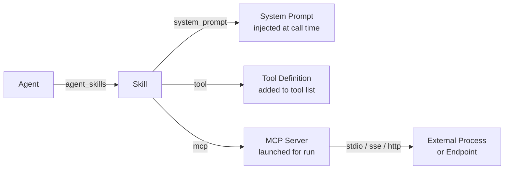

# MCP Servers and Skills

MCP servers extend agent capabilities with external tools. Skills are reusable snippets — system prompts, tool definitions, or MCP configurations — that can be attached to any agent.

Cross-references: [Agent Configuration](09-agent-configuration.md) · [External Integrations](26-external-integrations.md)

---

## MCP Server Overview

[Model Context Protocol (MCP)](https://modelcontextprotocol.io) servers run alongside Foundry and expose tools that agents can call during execution. Each server is configured once at the workspace level and can be enabled or disabled independently.

---

## MCP Server Fields

| Field | Type | Description |
|---|---|---|
| `id` | TEXT (UUID) | Primary key |
| `workspace_id` | TEXT | Owning workspace |
| `name` | TEXT | Display name |
| `description` | TEXT | Optional description |
| `command` | TEXT | Executable to launch (stdio transport) |
| `args_json` | TEXT | JSON array of command-line arguments |
| `env_json` | TEXT | JSON object of environment variables to inject |
| `transport` | TEXT | `stdio` · `sse` · `http` |
| `is_enabled` | INTEGER | `1` to include in agent tool calls |

---

## Transport Types

### `stdio` (default)
The server process is launched as a child process. Communication happens over standard input/output. Most MCP servers use this transport.

### `sse`
The server exposes a Server-Sent Events endpoint over HTTP. Foundry connects as an SSE client.

### `http`
The server exposes a plain HTTP endpoint. Foundry sends JSON-RPC requests over HTTP.

---

## Preset MCP Servers

Five preset configurations are available in the UI to get started quickly:

### GitHub MCP
Interact with GitHub repositories, issues, and pull requests.

```json
{
  "name": "GitHub MCP",
  "command": "npx",
  "args_json": ["-y", "@modelcontextprotocol/server-github"],
  "env_json": { "GITHUB_TOKEN": "${GITHUB_TOKEN}" },
  "transport": "stdio"
}
```

### Filesystem MCP
Read and write local files within a configured root directory.

```json
{
  "name": "Filesystem MCP",
  "command": "npx",
  "args_json": ["-y", "@modelcontextprotocol/server-filesystem", "/workspace"],
  "env_json": {},
  "transport": "stdio"
}
```

### Exa Search MCP
Web search via the Exa API.

```json
{
  "name": "Exa Search MCP",
  "command": "npx",
  "args_json": ["-y", "exa-mcp-server"],
  "env_json": { "EXA_API_KEY": "${EXA_API_KEY}" },
  "transport": "stdio"
}
```

### Context7 MCP
Look up library and framework documentation.

```json
{
  "name": "Context7 MCP",
  "command": "npx",
  "args_json": ["-y", "@upstash/context7-mcp"],
  "env_json": {},
  "transport": "stdio"
}
```

### Postgres MCP
Run read-only queries against a PostgreSQL database.

```json
{
  "name": "Postgres MCP",
  "command": "npx",
  "args_json": ["-y", "@modelcontextprotocol/server-postgres"],
  "env_json": { "DATABASE_URL": "${DATABASE_URL}" },
  "transport": "stdio"
}
```

---

## MCP Server API

| Method | Endpoint | Description |
|---|---|---|
| `GET` | `/api/mcp` | List MCP servers for the workspace |
| `GET` | `/api/mcp/:id` | Get a single MCP server |
| `POST` | `/api/mcp` | Create an MCP server |
| `PUT` | `/api/mcp/:id` | Update an MCP server |
| `DELETE` | `/api/mcp/:id` | Delete an MCP server |

---

## Skills Overview

Skills are reusable building blocks that augment an agent's behaviour. A skill can add instructions to the system prompt, inject an MCP server configuration, or define a callable tool function.

---

## Skill Types

### `system_prompt`
Plain text prepended to the agent's system prompt. Use this to add domain knowledge, personas, or standing instructions without modifying the agent directly.

### `mcp`
An MCP server configuration embedded as a skill. Attaching this skill to an agent enables the associated MCP server for that agent's runs.

### `tool`
A JSON tool/function definition (following the OpenAI function-calling schema). Attaching this skill makes the tool available in the agent's tool-call loop.

---

## Skill Fields

| Field | Type | Description |
|---|---|---|
| `id` | TEXT (UUID) | Primary key |
| `workspace_id` | TEXT | Owning workspace |
| `name` | TEXT | Display name |
| `description` | TEXT | Short description |
| `skill_type` | TEXT | `system_prompt` · `mcp` · `tool` |
| `content` | TEXT | Prompt text, MCP config JSON, or tool definition JSON |
| `is_public` | INTEGER | `1` to share across workspaces |

---

## Skills Catalog

The catalog provides 15 curated, ready-to-install skills:

- **9 system_prompt skills** — e.g. code reviewer persona, security auditor, technical writer, data analyst, and more.
- **3 tool skills** — reusable tool/function definitions.
- **3 MCP skills** — GitHub MCP, Google Workspace MCP, Browser Use MCP.

```http
GET /api/skills/catalog
```

---

## Installing from the Catalog

Copy a catalog skill into your workspace:

```http
POST /api/skills
Content-Type: application/json

{
  "workspace_id": "ws-abc123",
  "catalog_id": "cat-github-mcp"
}
```

The skill is cloned into your workspace and can then be customised.

---

## Attaching Skills to Agents

Skills are linked via the `agent_skills` join table.

```http
POST /api/agents/:id/skills
Content-Type: application/json

{ "skill_id": "skill-abc123" }
```

Remove a skill from an agent:

```http
DELETE /api/skills/:id/agents/:agentId
```

---

## Skill Content Management

The `content` field stores the skill payload:

- **`system_prompt`** — raw text appended before the agent's own system prompt.
- **`mcp`** — JSON object describing the MCP server (`command`, `args`, `env`, `transport`).
- **`tool`** — JSON object following the function-calling schema (`name`, `description`, `parameters`).

---

## Public Skills

Setting `is_public = 1` makes a skill visible to all workspaces in the instance. This is used by the built-in catalog and can be used to share custom skills across teams.

---

## Skill–Agent–MCP Relationships


