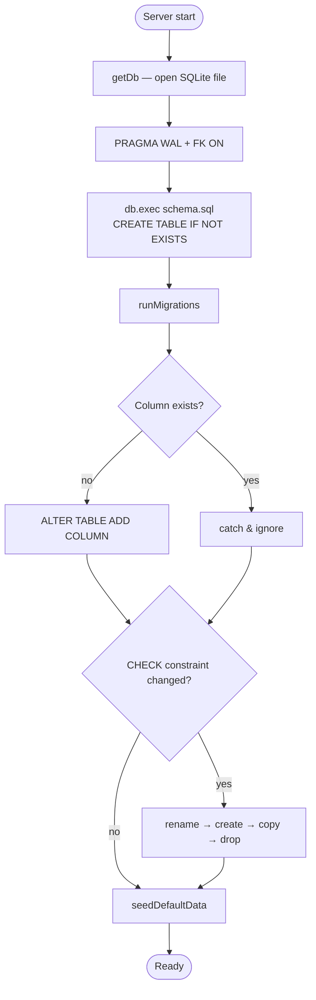

# Database Operations

Cross-references: [Architecture Overview](01-architecture-overview.md) · [Deployment Guide](15-deployment-guide.md)

---

## SQLite Setup

Foundry uses **better-sqlite3** — a synchronous SQLite binding for Node.js. On startup two pragmas are applied:

```sql
PRAGMA journal_mode = WAL;   -- write-ahead logging
PRAGMA foreign_keys = ON;    -- enforce FK constraints and cascades
```

---

## Database Singleton

`getDb()` in `backend/src/db/index.js` returns a single shared instance, created on first call and reused for the lifetime of the process. This is safe because better-sqlite3 is synchronous and Node.js is single-threaded.

---

## Schema Initialization

On startup the backend reads `schema.sql` and runs `db.exec()` to create any missing tables. All `CREATE TABLE` statements use `IF NOT EXISTS`, so they are safe to replay.

---

## Migration System

`runMigrations()` is called immediately after schema initialization. Migrations are written inline in `db/index.js` and are idempotent — safe to run on every startup.

### `addColumnIfMissing(table, column, definition)`

Attempts `ALTER TABLE … ADD COLUMN`. If the column already exists SQLite raises an error, which is silently caught. This is the standard pattern for additive schema changes.

### Table Recreation for CHECK Constraint Changes

SQLite does not support `ALTER TABLE … MODIFY COLUMN`. When a `CHECK` constraint changes, the migration:

1. Renames the existing table to `_old_<table>`.
2. Creates the new table with the updated definition.
3. Copies rows with `INSERT INTO new SELECT … FROM _old`.
4. Drops the `_old` table.

### Migration Flow



---

## Seed Data

`seedDefaultData()` runs after migrations. If no workspaces, projects, or agents exist it inserts minimal defaults so the UI starts in a usable state. This only runs once — subsequent startups find existing rows and skip insertion.

---

## WAL Mode Benefits

| Benefit | Detail |
|---|---|
| Concurrent reads | Readers never block writers; writers never block readers |
| Better write throughput | Appends to WAL file; checkpoint in background |
| Crash safety | Incomplete writes are not applied to the main db file |
| Safe file copy | The database file can be copied while readers are active |

---

## Foreign Key Enforcement

`PRAGMA foreign_keys = ON` enables:

- Referential integrity checks on `INSERT` / `UPDATE`.
- `ON DELETE CASCADE` / `ON DELETE SET NULL` defined in the schema.

---

## Backup Strategies

**File copy (simplest)**
```bash
cp foundry.db foundry.db.bak
```
Safe in WAL mode even while the server is running (as long as you also copy the `-wal` and `-shm` sidecar files if they exist).

**sqlite3 online backup**
```bash
sqlite3 foundry.db ".backup '/backups/foundry-$(date +%Y%m%d).db'"
```

**Periodic cron**
```cron
0 3 * * * cp /var/lib/foundry/foundry.db /backups/foundry-$(date +\%Y\%m\%d).db
```

---

## Query Patterns

```js
// Single row
const row = db.prepare('SELECT * FROM agents WHERE id = ?').get(id);

// Multiple rows
const rows = db.prepare('SELECT * FROM agents WHERE workspace_id = ?').all(workspaceId);

// Mutation
db.prepare('UPDATE agents SET name = ? WHERE id = ?').run(name, id);
```

---

## Transaction Support

```js
const transfer = db.transaction((from, to, amount) => {
  db.prepare('UPDATE accounts SET balance = balance - ? WHERE id = ?').run(amount, from);
  db.prepare('UPDATE accounts SET balance = balance + ? WHERE id = ?').run(amount, to);
});

transfer(accountA, accountB, 100);
```

---

## Performance Notes

- Indexes are defined on all foreign key columns to speed up joins and cascades.
- WAL mode reduces write-lock contention for the concurrent HTTP request pattern.
- For large deployments consider increasing the SQLite page cache via `PRAGMA cache_size`.
