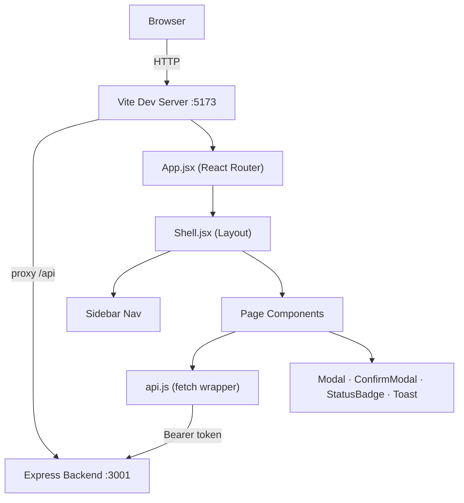

# Frontend Architecture

> **See also**: [Local Dev Setup](20-local-dev-setup.md) · [Backend Architecture](21-backend-architecture.md) · [API Reference](03-api-reference.md)

## Overview

The frontend is a React 18 single-page application built with Vite and styled with Tailwind CSS. It lives in the `frontend/` workspace of the monorepo.

## Vite Configuration

`frontend/vite.config.js` sets up a dev-server proxy so all `/api` requests are forwarded to the backend:

```js
server: {
  proxy: {
    '/api': 'http://localhost:3001'
  }
}
```

The production build outputs to `frontend/dist/`, which can be served by any static file host or an Nginx reverse proxy.

## React Router Setup

`frontend/src/App.jsx` defines the application route tree using React Router v6:

```
/login              → LoginPage
/                   → Shell (layout)
  /                 → DashboardPage
  /projects         → ProjectsPage
  /projects/:id     → ProjectDetailPage
  /boards/:id       → BoardPage
  /agents           → AgentsPage
  /teams            → TeamsPage
  /flows            → FlowsPage
  /flows/new        → FlowBuilderPage
  /flows/:id        → FlowDetailPage
  /chat             → ChatPage
  /queue            → QueuePage
  /runs/:id         → RunDetailPage
  /tasks/:id        → TaskDetailPage
  /companies        → CompaniesPage
  /mcp              → McpPage
  /skills           → SkillsPage
  /providers        → ProvidersPage
  /runtimes         → RuntimesPage
  /settings         → SettingsPage
  *                 → NotFoundPage
```

## Shell Layout Component

`frontend/src/components/Shell.jsx` is the persistent layout wrapper that renders the sidebar navigation and a `<main>` content area where child routes are rendered.

**Sidebar navigation items:**

| Label | Path | Description |
|---|---|---|
| Dashboard | / | Overview and stats |
| Projects | /projects | Project list |
| Companies | /companies | CRM companies |
| Agents | /agents | Agent management |
| Teams | /teams | Team hierarchy |
| Runtimes | /runtimes | Runtime configs |
| Providers | /providers | Provider configs |
| Skills | /skills | Skill library |
| MCP | /mcp | MCP server configs |
| Queue | /queue | Run queue monitor |
| Chat | /chat | Chat interface |
| Flows | /flows | Workflow builder |
| Settings | /settings | Workspace settings |

## Shared Components

### `Modal.jsx`
Generic modal dialog that accepts `isOpen`, `onClose`, and `children` props. Used throughout the app for create/edit forms.

### `ConfirmModal.jsx`
Specialised confirmation dialog with customisable message, confirm label, and `onConfirm`/`onCancel` callbacks. Used for destructive actions (delete).

### `StatusBadge.jsx`
Renders a coloured pill badge for status values:

| Status | Color |
|---|---|
| queued | gray |
| running | blue |
| success | green |
| failed | red |
| cancelled | yellow |
| draft | gray |
| active | green |
| archived | orange |

### `Toast.jsx`
Notification toast system. Renders a floating message with auto-dismiss. Accepts `message` and `type` (success/error/info).

## `api.js` — Fetch Wrapper

`frontend/src/components/api.js` (or `src/api.js`) is the central HTTP client. It:

1. Reads `VITE_API_URL` (or defaults to `/api`)
2. Injects `Authorization: Bearer <token>` from `localStorage`
3. Serialises request bodies as JSON
4. Returns parsed JSON or throws on non-2xx responses

```js
// Usage example
import api from '../components/api';

const workspaces = await api.get('/workspaces');
const created   = await api.post('/agents', { name: 'My Agent', ... });
await api.put(`/agents/${id}`, updates);
await api.delete(`/agents/${id}`);
```

## Auth Token Management

- On successful login the JWT is stored with `localStorage.setItem('token', data.token)`
- `api.js` reads `localStorage.getItem('token')` on every request
- `LoginPage` checks for an existing token and redirects to `/` if already authenticated
- On 401 responses `api.js` clears the token and redirects to `/login`

## Data Fetching Pattern

Each page component manages its own data with `useState` and `useEffect`:

```jsx
const [agents, setAgents] = useState([]);
const [loading, setLoading] = useState(true);

useEffect(() => {
  api.get(`/agents?workspace_id=${workspaceId}`)
    .then(setAgents)
    .finally(() => setLoading(false));
}, [workspaceId]);
```

There is no global state library (no Redux, Zustand, etc.) — all state is local to the component tree.

## Tailwind CSS Theme

`frontend/tailwind.config.js` extends the default Tailwind theme with custom colours matching the Foundry brand. All styling uses utility classes directly in JSX.

## Build Output

```bash
cd frontend
npm run build   # outputs to frontend/dist/
npm run preview # serve dist/ locally for testing
```

The `dist/` directory contains:
- `index.html` — SPA entry point (React Router handles all client-side routing)
- `assets/` — hashed JS/CSS bundles

## Architecture Diagram


