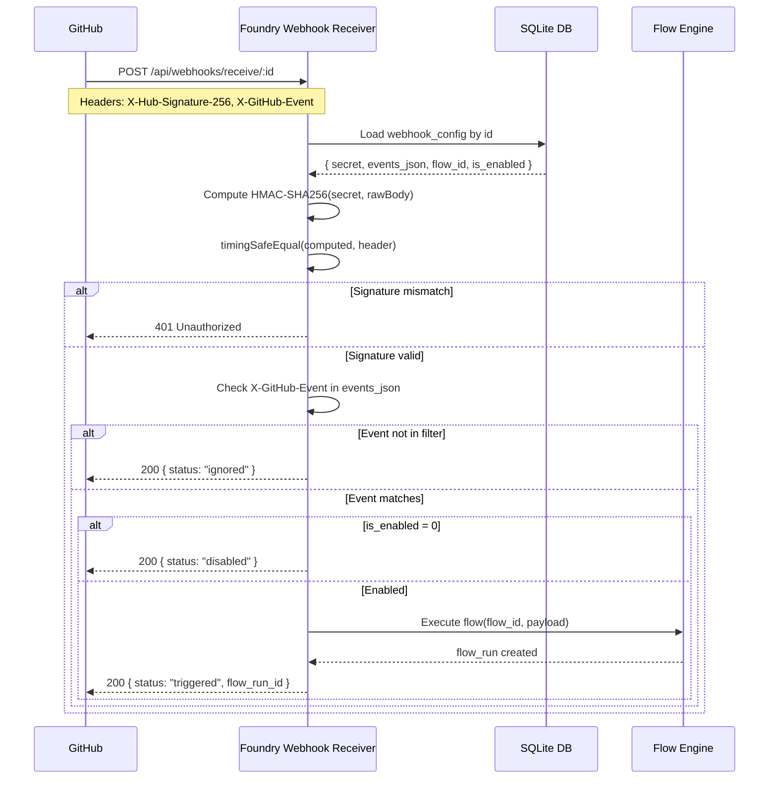

# Webhook System

## Overview

The webhook system allows GitHub events to trigger Foundry flows automatically. When a GitHub repository event occurs (push, pull request, issue, etc.), GitHub sends an HTTP POST to Foundry's webhook receiver endpoint, which verifies the signature, filters by event type, and triggers the linked flow.

---

## Webhook Config Fields

| Field | Type | Description |
|-------|------|-------------|
| `id` | UUID | Primary key |
| `workspace_id` | UUID | Owning workspace |
| `name` | TEXT | Human-readable label |
| `flow_id` | UUID | Linked flow to execute on trigger |
| `secret` | TEXT | HMAC-SHA256 signing secret (stored, never returned) |
| `events_json` | TEXT | JSON array of event names, e.g. `["push","pull_request"]` |
| `project_id` | UUID | Optional project scope |
| `is_enabled` | INTEGER | 0/1 enable flag |

---

## Webhook Config API

| Method | Path | Description |
|--------|------|-------------|
| `GET` | `/api/webhooks` | List webhook configs (secret masked) |
| `POST` | `/api/webhooks` | Create new webhook config |
| `PUT` | `/api/webhooks/:id` | Update webhook config |
| `DELETE` | `/api/webhooks/:id` | Delete webhook config |

> **Note:** The `secret` field is **never** returned in API responses. Instead, responses include `secret_set: true/false` to indicate whether a secret has been configured.

---

## Webhook Receiver Endpoint

```
POST /api/webhooks/receive/:id
```

This public endpoint receives incoming GitHub webhook payloads. It does **not** require JWT authentication — security is enforced via HMAC-SHA256 signature verification.

---

## HMAC-SHA256 Verification

GitHub signs every webhook payload using the configured secret:

1. GitHub computes `HMAC-SHA256(secret, rawBody)` and sends it as the `X-Hub-Signature-256` header in the format `sha256=<hex-digest>`.
2. Foundry reads the raw request body (before JSON parsing).
3. Foundry computes its own `HMAC-SHA256(storedSecret, rawBody)`.
4. The two digests are compared using `timingSafeEqual()` to prevent timing attacks.
5. If they do not match, the request is rejected with HTTP `401 Unauthorized`.

```
X-Hub-Signature-256: sha256=abc123...
```

---

## Event Type Filtering

After signature verification:

1. Read the `X-GitHub-Event` header (e.g. `push`, `pull_request`).
2. Parse the `events_json` array from the webhook config.
3. If the event type is **not** in the array, return HTTP `200` with `{"status":"ignored"}`.
4. If the event type matches, proceed to flow triggering.

---

## Flow Triggering

If all conditions are met:
- `is_enabled = 1`
- Event type matches `events_json`
- `flow_id` is set

Foundry executes the linked flow, passing the full GitHub webhook payload as flow input context.

---

## Secret Masking

The `webhook_configs.secret` column is never included in API responses. All GET/POST/PUT responses replace the secret with:

```json
{ "secret_set": true }
```

---

## GitHub Configuration

To point a GitHub repository at Foundry:

1. Go to **Repository → Settings → Webhooks → Add webhook**.
2. Set **Payload URL** to `https://your-foundry-host/api/webhooks/receive/<webhook-id>`.
3. Set **Content type** to `application/json`.
4. Enter the same **Secret** used when creating the webhook config.
5. Select the individual events or choose "Send me everything".
6. Click **Add webhook**.

---

## Supported Events

| Event | Description |
|-------|-------------|
| `push` | Branch push or tag |
| `pull_request` | PR opened/closed/merged |
| `issues` | Issue opened/edited/closed |
| `issue_comment` | Comment on issue or PR |
| `create` | Branch or tag created |
| `delete` | Branch or tag deleted |
| `workflow_run` | GitHub Actions workflow run |
| `release` | Release published/created |
| `fork` | Repository forked |
| `star` | Repository starred |

---

## Sequence Diagram



---

## Security

- **HTTPS required**: Always deploy Foundry behind TLS. GitHub will warn if the endpoint is HTTP-only.
- **Secret rotation**: Update the secret in both Foundry (PUT `/api/webhooks/:id`) and GitHub webhook settings simultaneously.
- **Event filtering**: Only subscribe to the events your flow needs — minimises noise and attack surface.
- **timingSafeEqual**: Prevents timing-based secret oracle attacks.
- **Raw body**: Signature is computed over the raw bytes, not the parsed JSON.

---

## Testing Webhooks

### Local Development with ngrok

```bash
# Expose local server
ngrok http 3001

# Use the ngrok URL as GitHub webhook payload URL
# e.g. https://abc123.ngrok.io/api/webhooks/receive/<id>
```

### GitHub Webhook Delivery Log

In GitHub → Repository Settings → Webhooks → (your webhook) → **Recent Deliveries**, you can:
- Inspect each delivery with full headers and payload.
- View the response status and body from Foundry.
- **Redeliver** any past event to re-trigger the webhook.

---

## Cross-References

- [GitHub Integration](13-github-integration.md)
- [Flow Builder](11-flow-builder.md)
- [Security Hardening](19-security-hardening.md)
