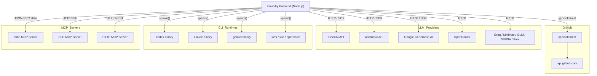

# External Integrations

## Overview

Foundry integrates with several categories of external services: GitHub via Octokit, LLM provider APIs, CLI runtime subprocesses, and MCP protocol servers.

---

## 1. GitHub API (Octokit)

**Package:** `@octokit/rest`

### Authentication

| Method | Description |
|--------|-------------|
| PAT via `access_token_env_var` | Environment variable name holding a Personal Access Token |
| GitHub App via `installation_id` + `app_id` | App-based installation token |
| `GITHUB_TOKEN` fallback | Default Actions token |

The `github_connections` table stores: `access_token_env_var`, `installation_id`, `app_id`, `workspace_id`.

### Supported Operations

| Operation | Octokit Method |
|-----------|---------------|
| List repositories | `octokit.repos.listForOrg` / `listForAuthenticatedUser` |
| Get repository | `octokit.repos.get` |
| Create branch | `octokit.git.createRef` |
| Create pull request | `octokit.pulls.create` |
| List issues | `octokit.issues.listForRepo` |
| Get issue | `octokit.issues.get` |
| Sync issues → cards | Foundry internal: issue → `cards` table row |

### Error Handling

| Status | Meaning | Handling |
|--------|---------|---------|
| `401` | Auth failure | Log error, surface to user |
| `403` | Forbidden / rate limit | Check `x-ratelimit-remaining`, back off |
| `404` | Repo/resource not found | Return descriptive error |
| `422` | Validation error | Surface GitHub message |

---

## 2. LLM Provider APIs

Cost calculation formula across all providers:

```
cost = (tokens_input × input_price_per_1k / 1000) + (tokens_output × output_price_per_1k / 1000)
```

Stored per run in `runs.cost_usd`.

### OpenAI

- **Package:** `openai` npm package or `node-fetch`
- **Endpoint:** `https://api.openai.com/v1/chat/completions`
- **Auth:** `Authorization: Bearer <OPENAI_API_KEY>`
- **Response fields:** `usage.prompt_tokens` → `tokens_input`, `usage.completion_tokens` → `tokens_output`

### Anthropic

- **Package:** `@anthropic-ai/sdk` or direct HTTP
- **Endpoint:** `https://api.anthropic.com/v1/messages`
- **Auth:** `x-api-key: <ANTHROPIC_API_KEY>`
- **Response fields:** `usage.input_tokens`, `usage.output_tokens`

### Google

- **Package:** `@google/generative-ai` SDK or REST
- **Endpoint:** `https://generativelanguage.googleapis.com/v1beta/models/:model:generateContent`
- **Auth:** `?key=<GOOGLE_API_KEY>`
- **Response fields:** `usageMetadata.promptTokenCount`, `usageMetadata.candidatesTokenCount`

### OpenRouter

- **API:** OpenAI-compatible at `https://openrouter.ai/api/v1`
- **Auth:** `Authorization: Bearer <OPENROUTER_API_KEY>`
- **Extra header:** `HTTP-Referer: <your-site>`
- Routes to dozens of underlying models via a single endpoint

### Other Providers

| Provider | Base URL | Auth Header |
|----------|----------|-------------|
| Minimax | `https://api.minimax.chat/v1` | `Authorization: Bearer` |
| GLM (Zhipu) | `https://open.bigmodel.cn/api/paas/v4` | JWT-signed key |
| NVIDIA | `https://integrate.api.nvidia.com/v1` | `Authorization: Bearer` |
| Groq | `https://api.groq.com/openai/v1` | `Authorization: Bearer` |
| Kimi (Moonshot) | `https://api.moonshot.cn/v1` | `Authorization: Bearer` |

---

## 3. CLI Runtime Subprocess Spawning

Foundry runs agentic CLI tools as child processes using Node.js `child_process.spawn()`.

### Supported Runtimes

| `runtime_type` | Default Binary |
|---------------|---------------|
| `codex` | `codex` |
| `claude-code` | `claude` |
| `gemini-cli` | `gemini` |
| `kimi-code` | `kimi` |
| `kilo-code` | `kilo` |
| `opencode` | `opencode` |

### Execution Flow

```
getDefaultBinary(runtime_type)
    ↓
spawn(binary, args, { cwd, env })
    ↓ stdin
task prompt (passed via stdin or CLI argument)
    ↓ stdout/stderr
streamed as run_events (type: 'stdout' | 'stderr')
    ↓ exit code
0 = success → run.status = 'completed'
non-0 = failure → run.status = 'failed'
```

### Timeout Handling

All subprocess calls are wrapped in `withTimeout(ms)`. If the process exceeds the configured timeout, it is killed and the run is marked `timed_out`.

### Fallback

If the binary is not found on `PATH`, `simulateRuntimeExecution()` is called — this returns a synthetic response useful for development/testing without the actual CLI tools installed.

---

## 4. MCP Protocol Servers

The Model Context Protocol (MCP) enables agents to call external tools via a standardised JSON-RPC interface.

### Transport Modes

| Mode | Description |
|------|-------------|
| `stdio` | Spawn MCP server as subprocess; JSON-RPC over stdin/stdout |
| `sse` | Connect to HTTP Server-Sent Events endpoint |
| `http` | Standard HTTP REST endpoint |

### Tool Discovery

```
→ Send: { "method": "tools/list" }
← Receive: { "tools": [{ "name": "...", "description": "...", "inputSchema": {...} }] }
```

### Tool Invocation

```
→ Send: { "method": "tools/call", "params": { "name": "toolName", "arguments": {...} } }
← Receive: { "content": [{ "type": "text", "text": "..." }] }
```

### MCP Server Config (`mcp_servers` table)

| Field | Description |
|-------|-------------|
| `transport` | `stdio` / `sse` / `http` |
| `command` | Binary/command to spawn (stdio only) |
| `url` | Endpoint URL (sse/http) |
| `env_json` | Environment variables for the server process |

---

## Integration Map



---

## Cross-References

- [Provider & Runtime Matrix](05-provider-runtime-matrix.md)
- [MCP & Skills](14-mcp-and-skills.md)
- [GitHub Integration](13-github-integration.md)
