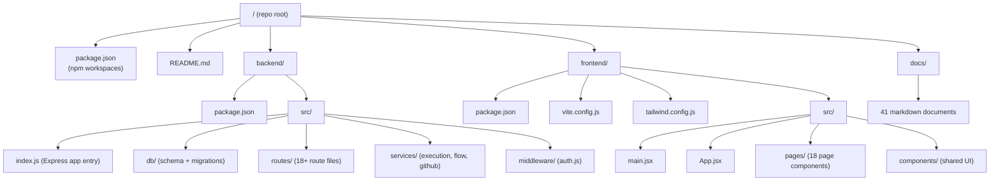
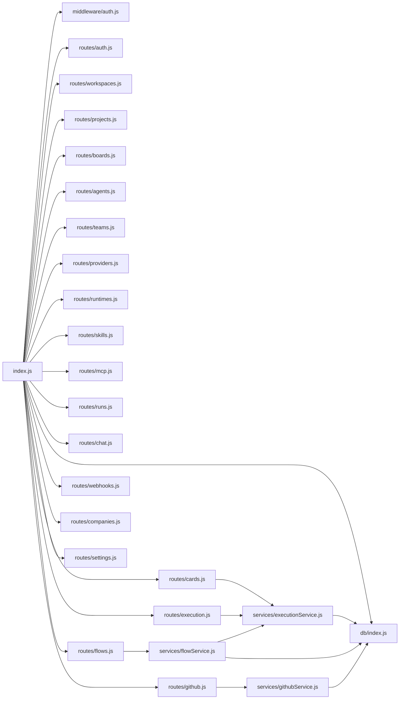

# Repository Map

Complete annotated file tree for the Foundry-Git monorepo.

---

## Overview Diagram



---

## Root Level

```
/
├── package.json          # npm workspaces root; defines "workspaces": ["backend","frontend"]
├── package-lock.json     # Lockfile for reproducible installs
└── README.md             # Project introduction and quick-start
```

### `package.json` (root)
Declares the two workspace packages and root-level convenience scripts (e.g., `npm run dev` starts both backend and frontend concurrently).

---

## `backend/`

```
backend/
├── package.json                  # Backend dependencies: express, better-sqlite3, jsonwebtoken,
│                                 #   @octokit/rest, uuid, zod, cors, dotenv
└── src/
    ├── index.js                  # Express app bootstrap: middleware registration, route mounting,
    │                             #   DB initialisation, server listen
    ├── db/
    │   ├── index.js              # DB connection factory: opens SQLite file, enables WAL mode,
    │   │                         #   enables foreign keys, runs migrations, exports `db` singleton
    │   └── schema.sql            # Full DDL: all 25 CREATE TABLE statements, indexes, CHECK constraints
    ├── routes/
    │   ├── auth.js               # POST /login, GET /status, user CRUD
    │   ├── workspaces.js         # Workspace CRUD
    │   ├── projects.js           # Project CRUD
    │   ├── boards.js             # Board + column CRUD
    │   ├── cards.js              # Card CRUD + POST /:id/execute
    │   ├── agents.js             # Agent CRUD + GET /templates
    │   ├── teams.js              # Team CRUD + member management
    │   ├── providers.js          # Provider config CRUD (api_key masked in responses)
    │   ├── runtimes.js           # Runtime config CRUD
    │   ├── skills.js             # Skill CRUD + GET /catalog
    │   ├── mcp.js                # MCP server CRUD
    │   ├── runs.js               # Run listing, cancel, SSE event stream
    │   ├── chat.js               # Chat message + session management
    │   ├── flows.js              # Flow + flow step CRUD, template system, execute endpoint
    │   ├── github.js             # GitHub connection CRUD, issue sync, repo/branch/PR operations
    │   ├── webhooks.js           # Webhook config CRUD + inbound receive endpoint
    │   ├── companies.js          # Company CRUD + company-project associations
    │   ├── settings.js           # Workspace settings read/write + cost summary
    │   └── execution.js          # POST /api/execute — direct execution dispatch
    ├── services/
    │   ├── executionService.js   # Core run orchestrator: dispatches provider API calls and
    │   │                         #   runtime CLI subprocesses, drives the Run state machine,
    │   │                         #   appends RunEvents, handles retries and fallback
    │   ├── flowService.js        # Flow run orchestrator: sequences flow steps, delegates each
    │   │                         #   step to executionService, manages FlowRun state
    │   └── githubService.js      # Octokit wrapper: creates/selects GitHub connections,
    │                             #   syncs issues→cards, creates branches and pull requests
    └── middleware/
        └── auth.js               # JWT verification middleware; reads AUTH_ENABLED flag,
                                  #   decodes Bearer token, attaches user to req.user,
                                  #   enforces role-based access
```

### Key Backend Files

#### `src/index.js`
The Express application entry point. Responsibilities:
- Load `.env` via `dotenv`
- Initialise the database singleton from `src/db/index.js`
- Register global middleware: `cors`, `express.json`, request logging
- Mount all route modules under `/api/<resource>`
- Start the HTTP server on `PORT` (default `3001`)

#### `src/db/index.js`
Opens the SQLite database file (path from `DATABASE_PATH` env var, defaulting to `./data/foundry.db`). Immediately after open:
1. `PRAGMA journal_mode=WAL`
2. `PRAGMA foreign_keys=ON`
3. Runs any pending migration scripts from `schema.sql`

Exports a single `db` instance used throughout the routes and services.

#### `src/db/schema.sql`
Complete DDL for all 25 tables. The source of truth for the data model. See [Data Model](02-data-model.md) for the annotated reference.

#### `src/services/executionService.js`
The heart of the execution layer. Handles:
- **Provider mode**: constructs LLM API requests, streams responses, tallies token costs
- **Runtime mode**: spawns CLI subprocess, captures stdout/stderr as `run_events`, monitors exit code
- Retry logic respecting `execution_policies`
- Fallback to `fallback_provider_config_id` on failure

#### `src/middleware/auth.js`
When `AUTH_ENABLED` is `true`, extracts the JWT from `Authorization: Bearer <token>`, verifies with `JWT_SECRET`, and attaches the decoded payload to `req.user`. Returns `401` on missing/invalid tokens and `403` on insufficient role.

---

## `frontend/`

```
frontend/
├── package.json              # Frontend dependencies: react, react-dom, react-router-dom,
│                             #   @vitejs/plugin-react, tailwindcss, autoprefixer, postcss
├── vite.config.js            # Vite config: React plugin, dev server proxy (/api → :3001)
├── tailwind.config.js        # Tailwind config: content paths, custom theme extensions
├── postcss.config.js         # PostCSS config for Tailwind
├── index.html                # HTML shell: mounts <div id="root">, loads main.jsx
└── src/
    ├── main.jsx              # React entry: renders <App /> into #root with BrowserRouter
    ├── App.jsx               # Top-level router: defines all route → page component mappings,
    │                         #   wraps with auth guards and Shell layout
    ├── pages/
    │   ├── Dashboard.jsx     # Workspace overview: run stats, recent activity
    │   ├── Projects.jsx      # Project list + create/edit/delete
    │   ├── Board.jsx         # Kanban board view: drag-and-drop columns and cards
    │   ├── Agents.jsx        # Agent list + create/edit/delete + memory management
    │   ├── Teams.jsx         # Team hierarchy list + member management
    │   ├── Flows.jsx         # Flow list + status management
    │   ├── FlowBuilder.jsx   # Visual flow step editor: add/reorder/configure steps
    │   ├── FlowDetail.jsx    # Flow run history and step execution details
    │   ├── Chat.jsx          # Chat interface: session management + real-time messaging
    │   ├── Queue.jsx         # Run queue: filterable list of all runs with status badges
    │   ├── RunDetail.jsx     # Run detail: event log stream, metadata, cost breakdown
    │   ├── Companies.jsx     # Company list + project association management
    │   ├── MCP.jsx           # MCP server management: add/edit/enable/disable servers
    │   ├── Skills.jsx        # Skill library: create/edit skills, assign to agents
    │   ├── Providers.jsx     # Provider config management (api_key masked in UI)
    │   ├── Runtimes.jsx      # Runtime config management
    │   ├── Settings.jsx      # Workspace settings + cost summary dashboard
    │   └── Login.jsx         # Authentication form (shown when AUTH_ENABLED=true)
    └── components/
        ├── Shell.jsx         # Application chrome: sidebar navigation, workspace selector,
        │                     #   top bar with user menu
        ├── Modal.jsx         # Generic modal wrapper with backdrop and close handling
        ├── ConfirmModal.jsx  # Specialised confirmation dialog for destructive actions
        ├── StatusBadge.jsx   # Colour-coded badge component for run/flow statuses
        ├── Toast.jsx         # Toast notification system: success/error/info toasts
        └── api.js            # Centralised API client: wraps fetch with base URL, auth
                              #   header injection, and error normalisation
```

### Key Frontend Files

#### `src/App.jsx`
Defines the client-side route tree using React Router v6. Protected routes are wrapped in an auth guard that redirects to `/login` when a JWT is absent and `AUTH_ENABLED` is detected. The `Shell` layout is applied to all authenticated routes.

#### `src/components/api.js`
All API calls flow through this module. It:
- Prepends the configured `VITE_API_URL` (default `/api` via Vite proxy)
- Attaches the `Authorization: Bearer <token>` header from `localStorage`
- Normalises HTTP error responses into thrown `Error` objects
- Provides typed helper functions per resource group

#### `vite.config.js`
In development, proxies `/api` requests to `http://localhost:3001`, eliminating CORS issues during local development.

---

## `docs/`

```
docs/
├── README.md                      # 00 — Documentation table of contents (this suite)
├── 01-architecture-overview.md    # High-level system architecture + diagrams
├── 02-data-model.md               # ER diagram + full table reference
├── 03-api-reference.md            # Complete REST endpoint documentation
├── 04-auth-and-rbac.md            # Authentication system and RBAC
├── 05-provider-runtime-matrix.md  # Provider and runtime support matrix
├── 06-event-and-run-lifecycle.md  # Run state machine and event lifecycle
├── 07-workspace-and-project-guide.md
├── 08-board-and-card-workflow.md
├── 09-agent-configuration.md
├── 10-team-hierarchy.md
├── 11-flow-builder.md
├── 12-chat-interface.md
├── 13-github-integration.md
├── 14-mcp-and-skills.md
├── 15-deployment-guide.md
├── 16-configuration-reference.md
├── 17-database-operations.md
├── 18-monitoring-and-logging.md
├── 19-security-hardening.md
├── 20-local-dev-setup.md
├── 21-backend-architecture.md
├── 22-frontend-architecture.md
├── 23-testing-strategy.md
├── 24-contributing.md
├── 25-webhook-system.md
├── 26-external-integrations.md
├── 27-api-client-guide.md
├── 28-glossary.md                 # Domain term definitions
├── 29-decision-log.md             # Architecture Decision Records
├── 30-repo-map.md                 # This document
├── 31-roadmap-overview.md
├── 32-rfc-company-scoping.md
├── 33-rfc-agent-catalog.md
├── 34-rfc-graph-workflows.md
├── 35-rfc-advanced-memory.md
├── 36-rfc-chat-sessions.md
├── 37-rfc-python-worker.md
├── 38-rfc-observability.md
├── 39-rfc-plugin-system.md
└── 40-rfc-multi-tenant-saas.md
```

---

## Dependency Graph

The following diagram shows the primary import relationships between backend modules:



---

*See also*: [Architecture Overview](01-architecture-overview.md), [Data Model](02-data-model.md)
