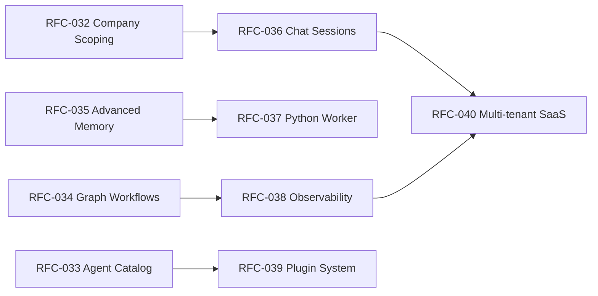

# Roadmap Overview

This document provides a high-level view of the Foundry-Git platform roadmap, organised into three phases based on complexity and dependency order.

---

## Phase 1 — Near-term

Foundational improvements that unblock core use-cases and harden existing features.

| RFC | Title | Document |
|-----|-------|----------|
| RFC-032 | Company Scoping | [32-rfc-company-scoping.md](32-rfc-company-scoping.md) |
| RFC-033 | Agent Catalog | [33-rfc-agent-catalog.md](33-rfc-agent-catalog.md) |
| RFC-036 | Chat Sessions | [36-rfc-chat-sessions.md](36-rfc-chat-sessions.md) |

**RFC-032 — Company Scoping:** Promotes the `companies` table from a CRM-only concept to a first-class organisational scope. Projects, agents, and chat sessions become optionally scoped to a company.

**RFC-033 — Agent Catalog:** Introduces a versioned `agent_templates` table and a "install from template" flow, replacing the current hardcoded template list.

**RFC-036 — Chat Sessions:** Adds a `chat_sessions` table with metadata, mode, cost aggregation, and project/company linkage, replacing the bare `session_id` string.

---

## Phase 2 — Medium-term

Architectural enhancements that expand platform power and flexibility.

| RFC | Title | Document |
|-----|-------|----------|
| RFC-034 | Graph Workflows | [34-rfc-graph-workflows.md](34-rfc-graph-workflows.md) |
| RFC-035 | Advanced Memory | [35-rfc-advanced-memory.md](35-rfc-advanced-memory.md) |
| RFC-037 | Python Worker | [37-rfc-python-worker.md](37-rfc-python-worker.md) |

**RFC-034 — Graph Workflows:** Evolves the flow system from linear position-based steps to a full DAG model with `workflow_nodes` and `workflow_edges`, enabling conditional branching and parallel execution.

**RFC-035 — Advanced Memory:** Upgrades `agent_memories` with types, scopes, optional TTL, embedding vectors, and a memory candidates review queue for human-in-the-loop memory approval.

**RFC-037 — Python Worker:** Adds a Python sidecar service communicating with the Node.js backend via a SQLite job queue, providing ML capabilities (embeddings, RAG) unavailable in Node.js.

---

## Phase 3 — Long-term

Platform maturity, enterprise readiness, and extensibility.

| RFC | Title | Document |
|-----|-------|----------|
| RFC-038 | Observability | [38-rfc-observability.md](38-rfc-observability.md) |
| RFC-039 | Plugin System | [39-rfc-plugin-system.md](39-rfc-plugin-system.md) |
| RFC-040 | Multi-tenant SaaS | [40-rfc-multi-tenant-saas.md](40-rfc-multi-tenant-saas.md) |

**RFC-038 — Observability:** Structured JSON logging, OpenTelemetry traces/metrics, cost dashboards, budget alerting, and log aggregation integration.

**RFC-039 — Plugin System:** A plugin manifest format and dynamic loader enabling new providers, runtimes, MCP servers, and UI components to be added without core code changes.

**RFC-040 — Multi-tenant SaaS:** Full SaaS evolution: workspace isolation hardening, Stripe billing, SSO/SAML, per-tenant data residency, rate limiting, and an admin dashboard.

---

## Timeline Diagram

```mermaid
gantt
    title Foundry-Git Roadmap
    dateFormat YYYY-QQ
    axisFormat Q%q %Y

    section Phase 1 — Near-term
    RFC-032 Company Scoping       :p1a, 2025-Q1, 1Q
    RFC-033 Agent Catalog         :p1b, 2025-Q1, 1Q
    RFC-036 Chat Sessions         :p1c, 2025-Q2, 1Q

    section Phase 2 — Medium-term
    RFC-034 Graph Workflows       :p2a, 2025-Q2, 2Q
    RFC-035 Advanced Memory       :p2b, 2025-Q3, 1Q
    RFC-037 Python Worker         :p2c, 2025-Q3, 1Q

    section Phase 3 — Long-term
    RFC-038 Observability         :p3a, 2025-Q4, 1Q
    RFC-039 Plugin System         :p3b, 2026-Q1, 2Q
    RFC-040 Multi-tenant SaaS     :p3c, 2026-Q2, 2Q
```

---

## Dependency Graph


